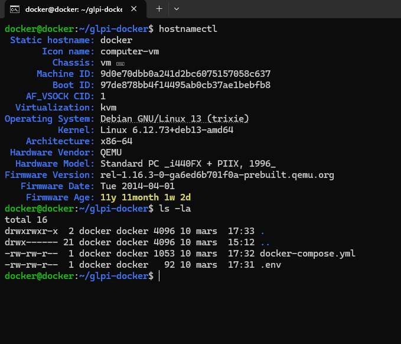
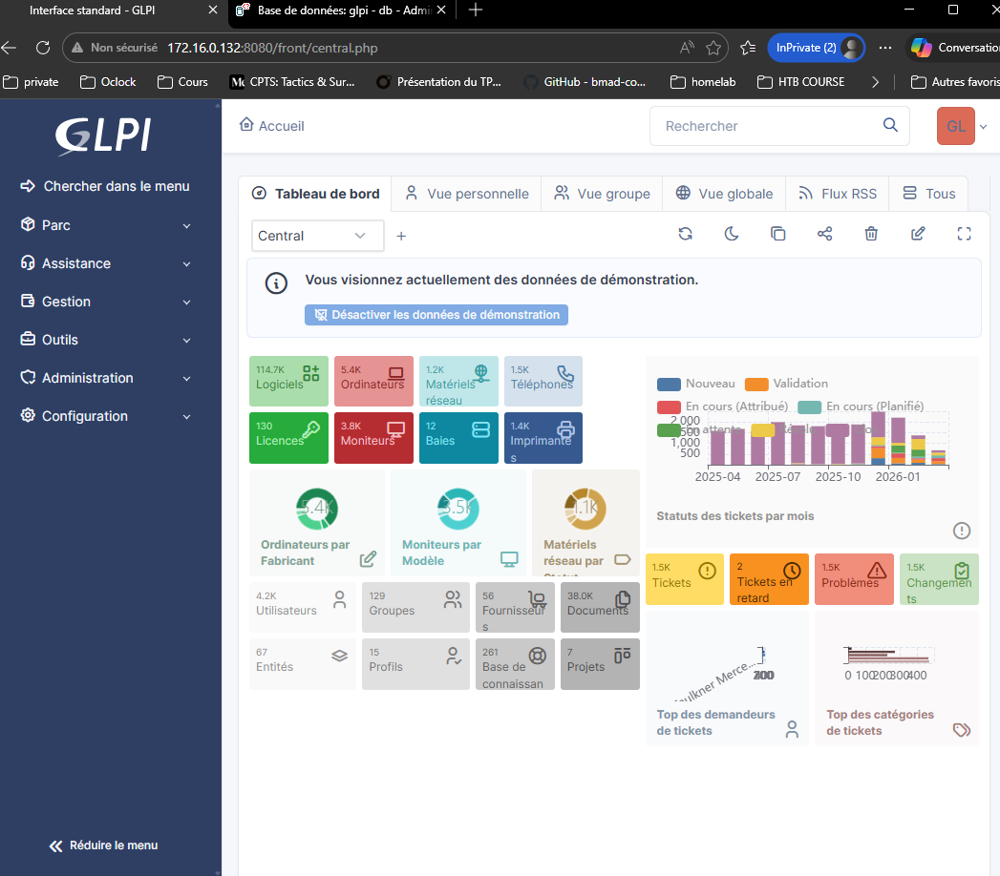
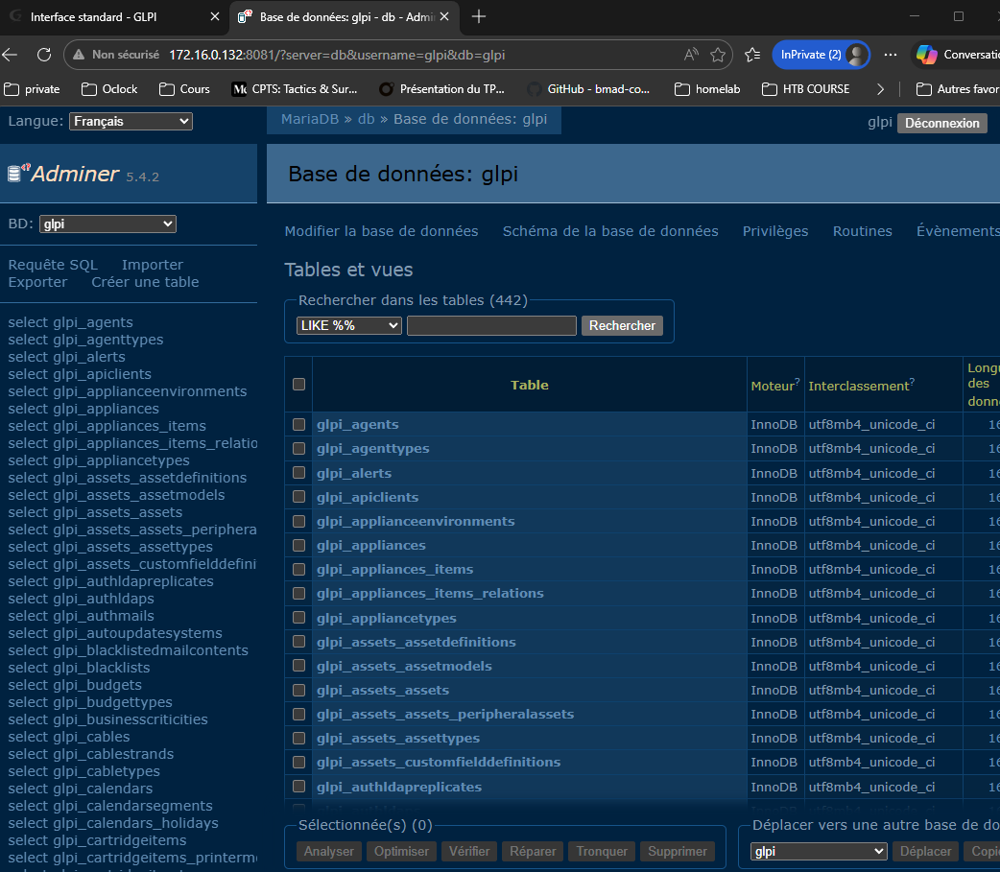

# 🐋 Déployer GLPI avec Docker Compose

## Énoncé

| Objectif de l'exercice | État | Détails de la réalisation |
| :--- | :---: | :--- |
| **Rédigé un fichier `docker-compose.yml` fonctionnel de zéro** | ✅ | Structure YAML validée avec services `glpi`, `db` et `adminer`. |
| **Configuré un service MariaDB avec variables d'environnement** | ✅ | Utilisation de `MYSQL_ROOT_PASSWORD` et `MYSQL_DATABASE`. |
| **Déployé GLPI et réalisé sa configuration initiale via le navigateur** | ✅ | Accès HTTP opérationnel et liaison avec la base de données réussie. |
| **Mis en place la persistance des données avec des volumes Docker** | ✅ | Volumes créés pour la base de données et les fichiers de configuration. |
| **(Bonus) Ajouté Adminer pour administrer la base de données** | ✅ | Interface GUI ajoutée sur le port 8080 pour la gestion SQL. |
| **(Bonus 2) — Fichier `.env`** | ✅ | les mots de passe et variables sensibles dans un fichiers. |
| **(Bonus 3) — Healthcheck** | ❌ | GLPI n'essaie de démarrer qu'une fois que MariaDB est réellement prêt à accepter des connexions. |

### Mise en place du fichier YAML : 

Voici mon fichier `docker-compose.yml`

[doc/docker-compose.yml](doc/docker-compose.yml)

1. *Utilisation d'un contenaire LXC sur proxmox et connection en SSH depuis mon hôte.*

> Rendu final :

2. *Interface GLPI via le port 8080*

3. *Connection sur Adminer via le port 8081*

