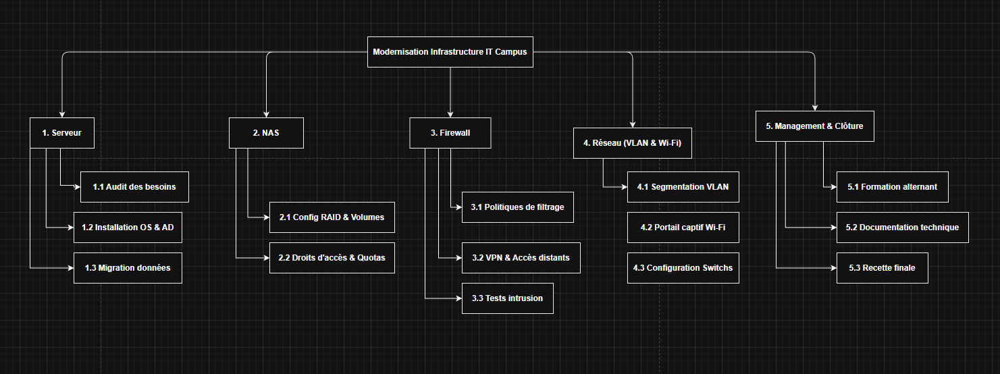

### CHALLENGE 1 : Gestion de projet LA NOTE DE CADRAGE DU BESOIN

# challenges C01

Ces challenges sont un projet fil rouge a suivre toute la saison C01

## Énoncé E1

### Contexte

Hier nous avons créé la note de cadrage du projet.

Aujourd’hui on vous demande de créer un WBS avec plusieurs niveaux de tâches :

Niveau 1 : grands lots (serveur, NAS, firewall, réseau)
Niveau 2-3 : tâches et sous-tâches

---
## 📄 WBS : Modernisation Infrastructure IT Campus

