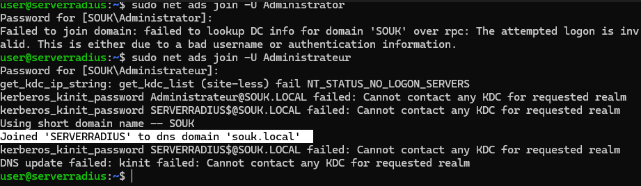
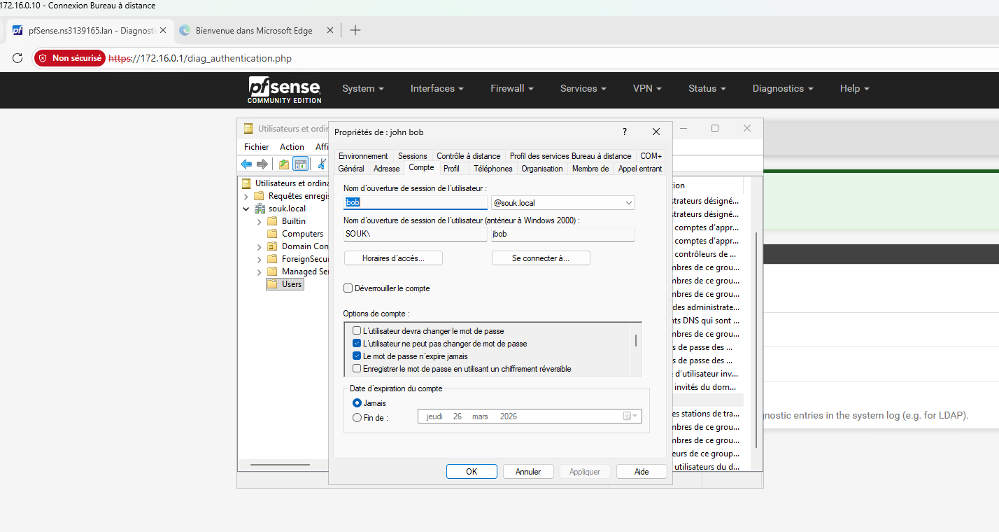
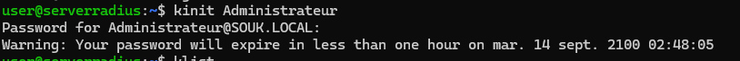
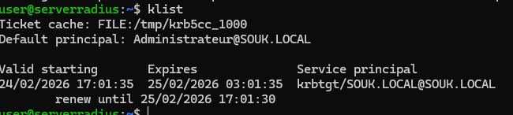
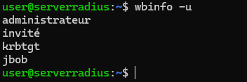
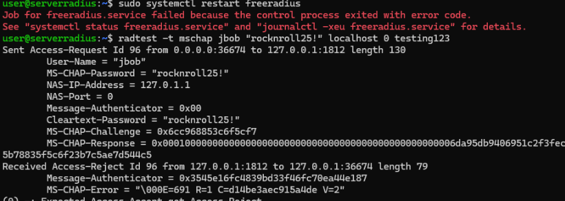
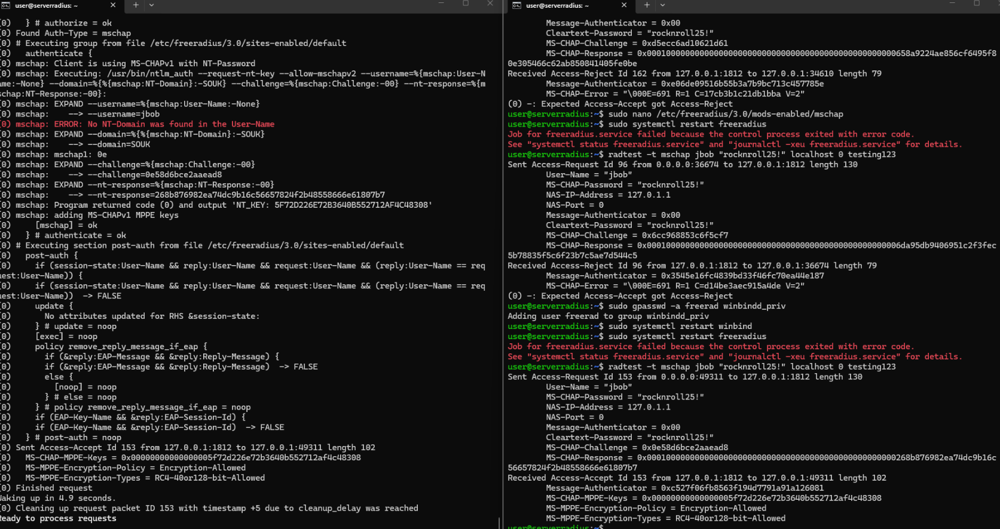
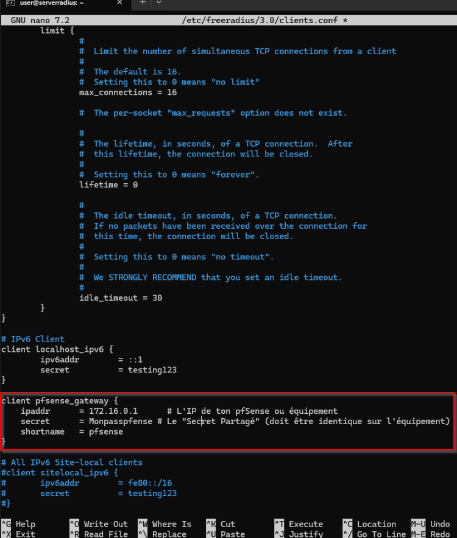
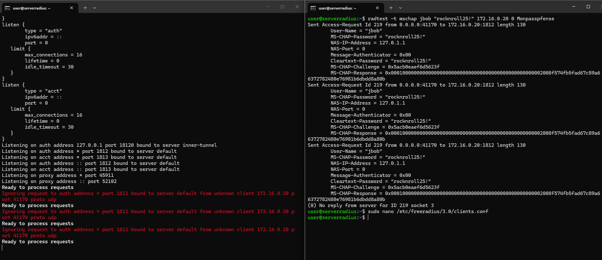
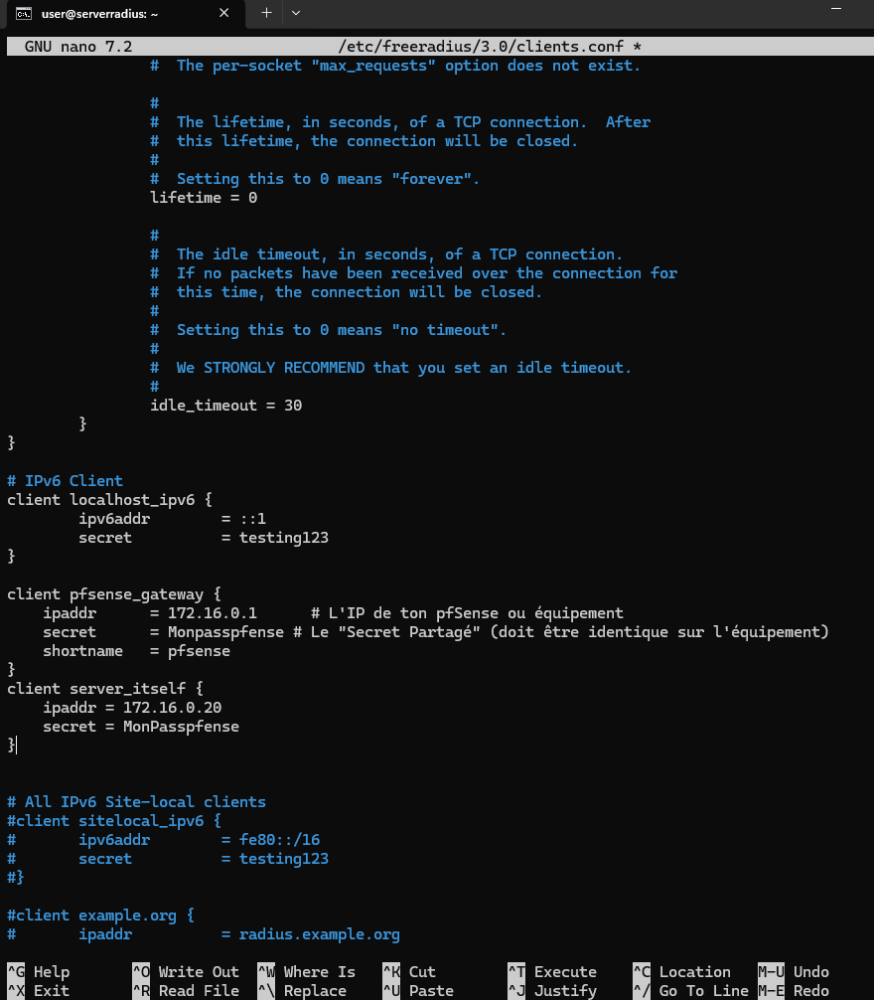

# 🛡️ Challenge — Intégration RADIUS & Active Directory

Ce projet documente la mise en place d'une infrastructure d'authentification centralisée utilisant **FreeRADIUS** sur Ubuntu Server, interfacé avec un contrôleur de domaine **Active Directory** sous Windows Server 2025.

---

## 🏗️ Architecture du Lab (Proxmox)

| Composant | Système d'Exploitation | Adresse IP | Rôle |
| :--- | :--- | :--- | :--- |
| **ServerAD** | Windows Server 2025 | `172.16.0.10` | Contrôleur de Domaine (`souk.local`) |
| **ServerRadius** | Ubuntu 24.04.3 LTS | `172.16.0.20` | Serveur FreeRADIUS |
| **Réseau** | VMB3 | `172.16.0.0/16` | Segment réseau dédié |

---

## 1. Configuration des Serveurs

### Contrôleur de Domaine (AD)
* **Nom du serveur :** `serverAD`
* **Domaine :** `souk.local`
* **NetBIOS :** `SOUK`


### Serveur RADIUS
* **Nom du serveur :** `serverradius`
* **Utilisateur local :** `rocknroll`


### Validation de la connectivité
Tests de ping bidirectionnels validés entre les deux machines du segment `172.16.0.0/16`.

* **Ping AD -> RADIUS :** 
* **Ping RADIUS -> AD :** 

---

## 2. Installation et Test Local de FreeRADIUS

Installation effectuée selon la [documentation officielle](https://www.freeradius.org/).

```bash
# Installation du paquet
sudo apt-get update
sudo apt-get install freeradius
```

### 1.3 Test de base (Local)
Validation du bon fonctionnement du démon FreeRADIUS avec l'utilisateur de test par défaut :

configuration du fichier :
/etc/freeradius/3.0/clients.conf "on note le secret partage
```bash
cat **/etc/freeradius/3.0/users** :
```
>**On note le secret "testing123"**


configuration du fichier :
/etc/freeradius/3.0/users "on créeer un utilisateur de test"


### 🛠️ Test de fonctionnement et analyse des logs

Pour valider le bon fonctionnement du serveur et observer le processus d'authentification en temps réel, j'ai utilisé deux terminaux SSH simultanés :

1. **Premier terminal (Mode Debug) :** Lancement de FreeRADIUS en mode interactif pour afficher les logs détaillés.
   ```bash
   user@serverradius:~$ sudo freeradius -X

2. **deuxieme terminal (Test d'authentification) :** Utilisation de l'utilitaire radtest pour envoyer une requête d'accès locale.

```bash
   user@serverradius:~$ radtest user pass localhost 0 testing123
```
> **RESULTATS ATTENDUS**
> - Le terminal 1 affiche des messages d'entrée et de sortie de FreeRADIUS.
> - Le terminal 2 affiche un message d'accès accepté : "**received Access-Accept**"


## 🤝 Raccordement entre AD et RADIUS

L'intégration repose sur l'utilisation de **Samba** et **Winbind** pour permettre à Linux de communiquer avec l'Active Directory, conformément à la [documentation officielle FreeRADIUS](https://www.freeradius.org/documentation/freeradius-server/4.0.0/howto/datastores/ad/index.html).

### 1. Installation des dépendances

```bash
sudo apt install samba winbind libpam-winbind libnss-winbind
sudo apt install krb5-user
```
### 2. Configuration de Samba
Avant de modifier les fichiers de configuration, une sauvegarde de l'original est effectuée par sécurité :

```bash
user@serverradius:~$ sudo cp /etc/samba/smb.conf /etc/samba/smb.confold
user@serverradius:~$ sudo nano /etc/samba/smb.conf

```
> **Mettre à jour avec vos informations d'AD** :


### 3. Ajouter le serveur à l'AD

```bash
user@serverradius:~$ sudo net ads join -U Administrateur

```

> **RESULTATS ATTENDUS**
> - La commande net ads join affiche des messages **joigned**



> - Nous pouvons aussi vérifier si l'ordinateur est aussi dans l'AD


### 3. Mise en place du protocole de communication entre l'AD et le serveur RADIUS
> ressources : https://www.freeradius.org/documentation/freeradius-server/4.0.0/howto/datastores/ad/ntlm_mschap.html

> **Pour que ntlm_auth (utilisé par FreeRADIUS) puisse interroger l'AD, Kerberos doit être fonctionnel.**

1. création d'un fichier sudo nano /etc/krb5.conf


2. vérification que le service winbind est fonctionnel


3. Mettre à jour le fichier /etc/freeradius/3.0/mods-enabled/mschap

> **attention à bien mettre votre nom AD NETBIOS dans la ligne , pour moi c'est SOUK !!! **

```bash
ntlm_auth = "/usr/bin/ntlm_auth --request-nt-key --allow-mschapv2 --username=%{mschap:User-Name:-None} --domain=%{%{mschap:NT-Domain}:-SOUK} --challenge=%{mschap:Challenge:-00} --nt-response=%{mschap:NT-Response:-00}"
```


4. création d'un user sur l'AD : jbob



5. Vérification que Winbind est fonctionnel ainsi que kerberos 

```bash
kinit Administrateur
```

> RESULTATS ATTENDUS




```bash
klist
```

> RESULTATS ATTENDUS




```bash
wbinfo -u
```

> RESULTATS ATTENDUS




```bash
wbinfo -g
```

> RESULTATS ATTENDUS


6. Test de connection 

```bash
radtest -t mschap jbob "MDP de l'AD" localhost 0 testing123
```

> **MESSAGE D'erreur**
> - Le terminal 1 affiche des messages d'entrée et de sortie de FreeRADIUS.



6. Avec mes talents de googlefu , je n'ai pas réussi à me connecter à cause d'un probleme à priori au niveau de permission, l'utilisateur qui lance FreeRADIUS (freerad) doit impérativement faire partie du groupe qui possède le droit d'interroger Winbind

> **Attention :** Le groupe winbindd doit avoir le droit de lire le fichier /etc/passwd
> je lui ajoute le droit et relance le service.

```bash
sudo gpasswd -a freerad winbindd
sudo systemctl restart winbind
sudo systemctl restart freeradius
user@serverradius:~$ sudo systemctl start freeradius
user@serverradius:~$ sudo systemctl enable freeradius
Synchronizing state of freeradius.service with SysV service script with /usr/lib/systemd/systemd-sysv-install.
Executing: /usr/lib/systemd/systemd-sysv-install enable freeradius
```

> **Nouveau Test - RESULTATS ATTENDUS**



> - Le terminal 1 affiche des messages d'entrée et de sortie de FreeRADIUS.
> - Le terminal 2 affiche un message d'accès accepté : "**received Access-Accept**"


### 4. — Configurer le client RADIUS , mettre adresse IP pfense et le secret

1. Configuration du fichier de configuration "clients.conf"

```bash
sudo nano /etc/freeradius/3.0/clients.conf
sudo systemctl restart freeradius
```


2. Configuration de la pfense 

> Mise en place de l'authentification servers, indiquer le secret mis dans le fichier de configuration "clients.conf"


3. Test de d'authentification depuis la pfense avec l'utisateur jbob de l'AD

### 5. — FINAL FIGHT : test de d'authenfication depuis la PFsEnse ok avec l'utisateur jbob de l'AD


### 6. — FINAL FIGHT : test de d'authenfication en local depuis le serveur radius ok avec l'utisateur jbob de l'AD


> le premier rad test montre la connection reussie en local et le deuxieme rad test montre la connection reussie en distante.
> Le serveur FreeRADIUS est parfaitement integre au ton Active Directory !

### 6. — FINAL FIGHT : test de d'authenfication vers le pfense depuis le serveur radius ok avec l'utisateur jbob de l'AD


la commande ne fonctionne pas :


Tu dois ajouter ton propre serveur comme client dans /etc/freeradius/3.0/clients.conf pour qu'il s'autorise à se répondre à lui-même sur son IP réseau.



restat 

> **FINI !**