# 🛡️ Challenge — RADIUS

Sur PROXMOX:
installation d'un serveur windows 2025 (domaine active directory)
installation d'un serveur RADIUS sur ubuntu 24.04.3 live server.

Sur vmb3 : 172.16.0.0/16

Mise en place d'un nom de domaine 
Adresse IP fixe sur les 2 machines

Nom du serveur : serverAD 
IP : 172.16.0.10 
Nom du domaine : souk.local
Nom NetBios : SOUK

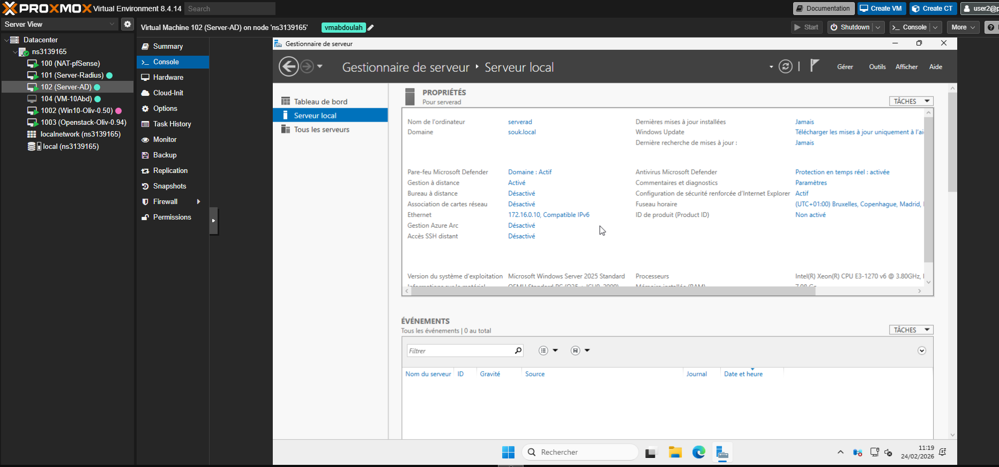

Nom du serveur : serverradius
IP : 172.16.0.20
user
rocknroll

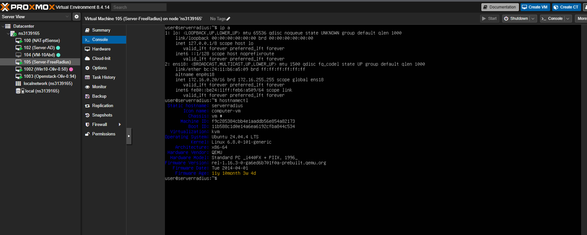

Test de connection entre AD et radius ok 

> entre le serveur AD et le serveur radius

> entre le serveur Radius et le AD

Test de connectivité ok !

installation de FREERADIUS suivant le modele de documentation officielle de freeradius

[SITE FREE RADIUS HERE !](https://www.freeradius.org/)

apt-get install freeradius

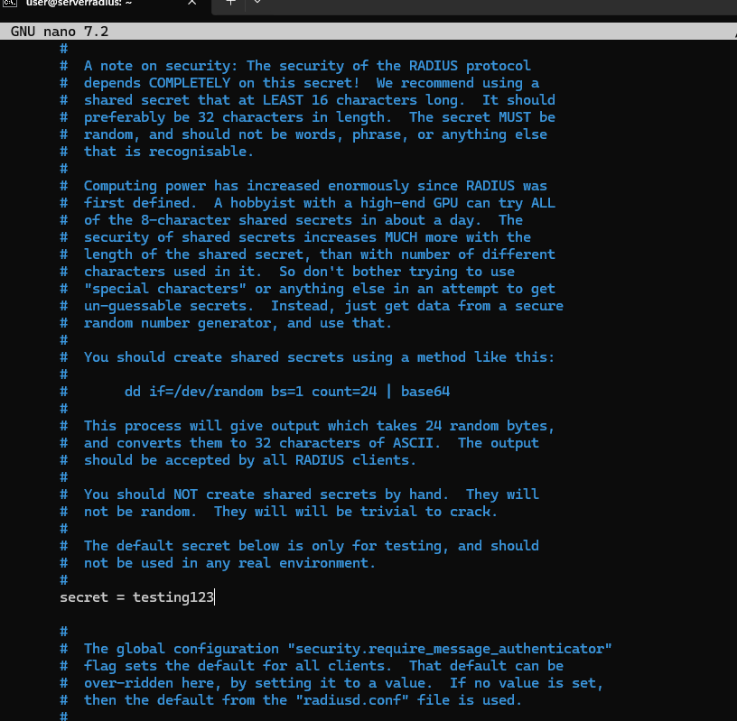

secret = testing123

user
pass 

radtest user tpass localhost 0 testing123

Pour faire mon test sur mon serveur radius

j'ai ouvert 2 cmd en connection ssh vers le serveur radius (VPN) sur mon hote windows.

Pour voir les logs : j'ai taper sur le premier CMD :
user@serverradius:~$ sudo freeradius -X

dans le deuxième CMD :
user@serverradius:~$ radtest user pass localhost 0 testing123

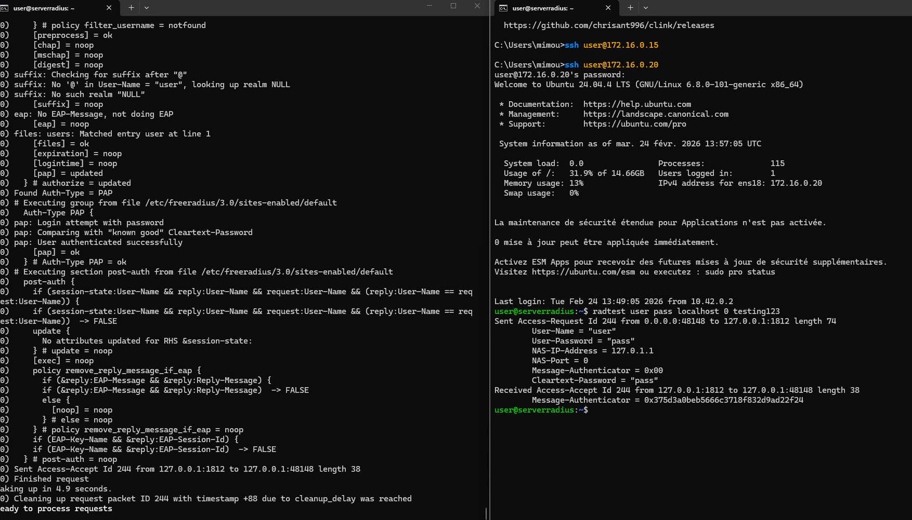

Raccordement entre AD et radius via
https://www.freeradius.org/documentation/freeradius-server/4.0.0/howto/datastores/ad/index.html

sudo apt install samba winbind libpam-winbind libnss-winbind

avant de toucher au ficheir conf ; sauvegarde de l'ancienne:
user@serverradius:~$ sudo cp /etc/samba/smb.conf /etc/samba/smb.confold

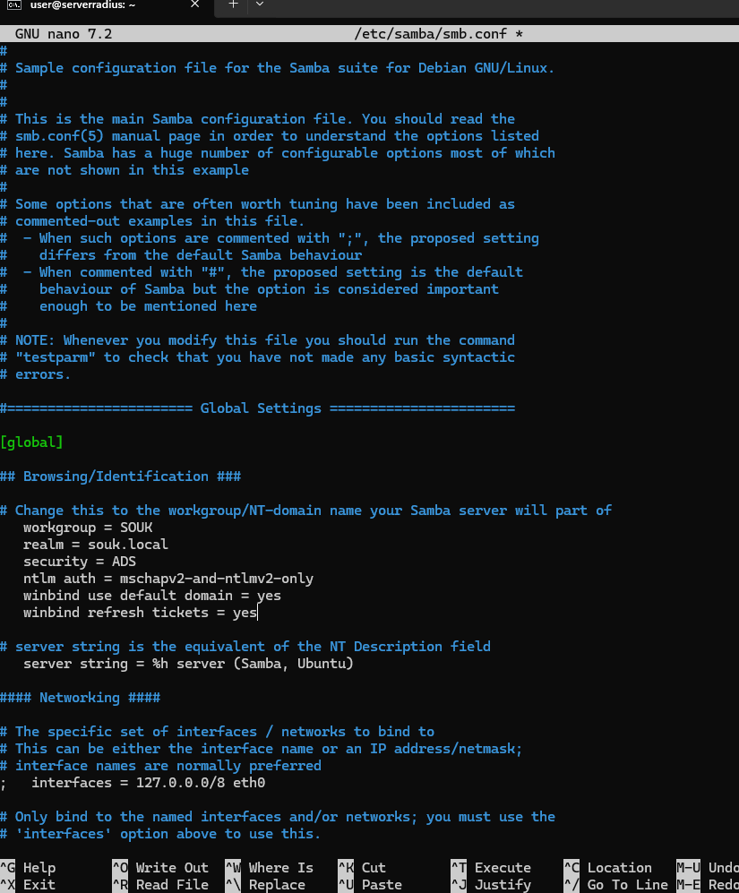

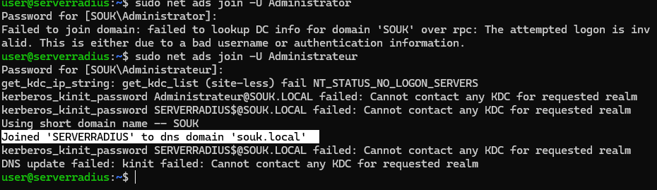

mon serveur est joint à l'AD :
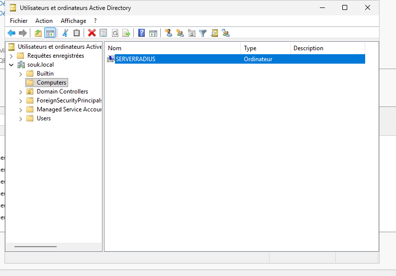

Pour que ntlm_auth (utilisé par FreeRADIUS) puisse interroger l'AD, Kerberos doit être fonctionnel.

mise en place d'un fichier de configuration /etc/krb5.conf
sudo nano /etc/krb5.con

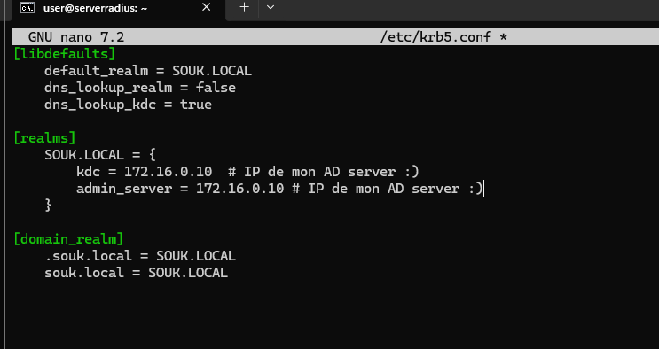

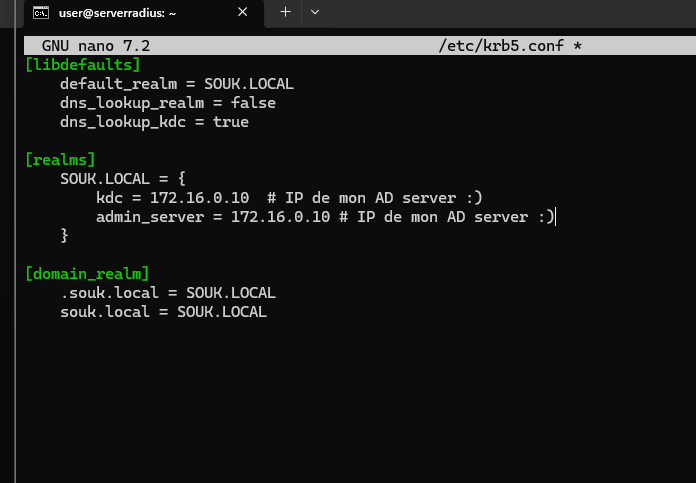

vérification de la configuration 

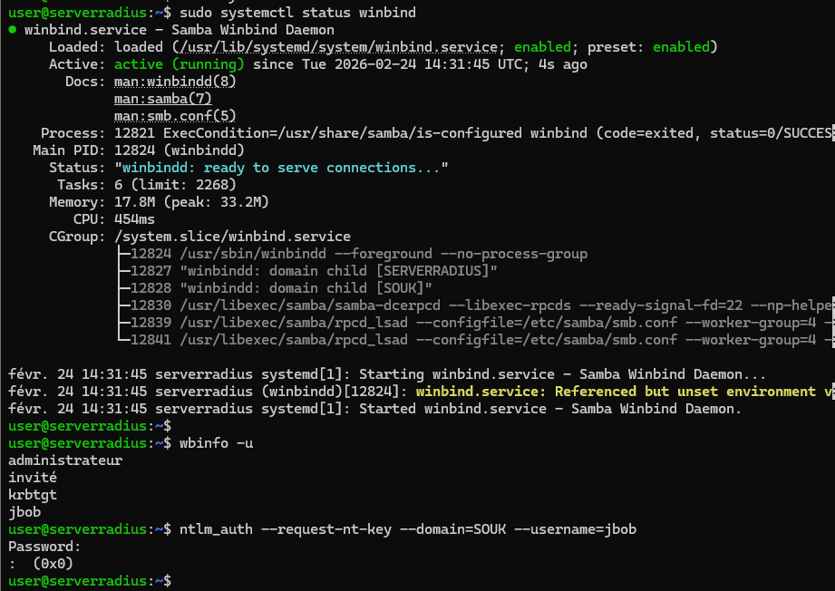

teest ok maintenant que le test ok est ok

je vais dire comme indiqué dans la doc :Configure FreeRADIUS to use ntlm_auth for MS-CHAP

https://www.freeradius.org/documentation/freeradius-server/4.0.0/howto/datastores/ad/ntlm_mschap.html

mise à jour de la ligne : 

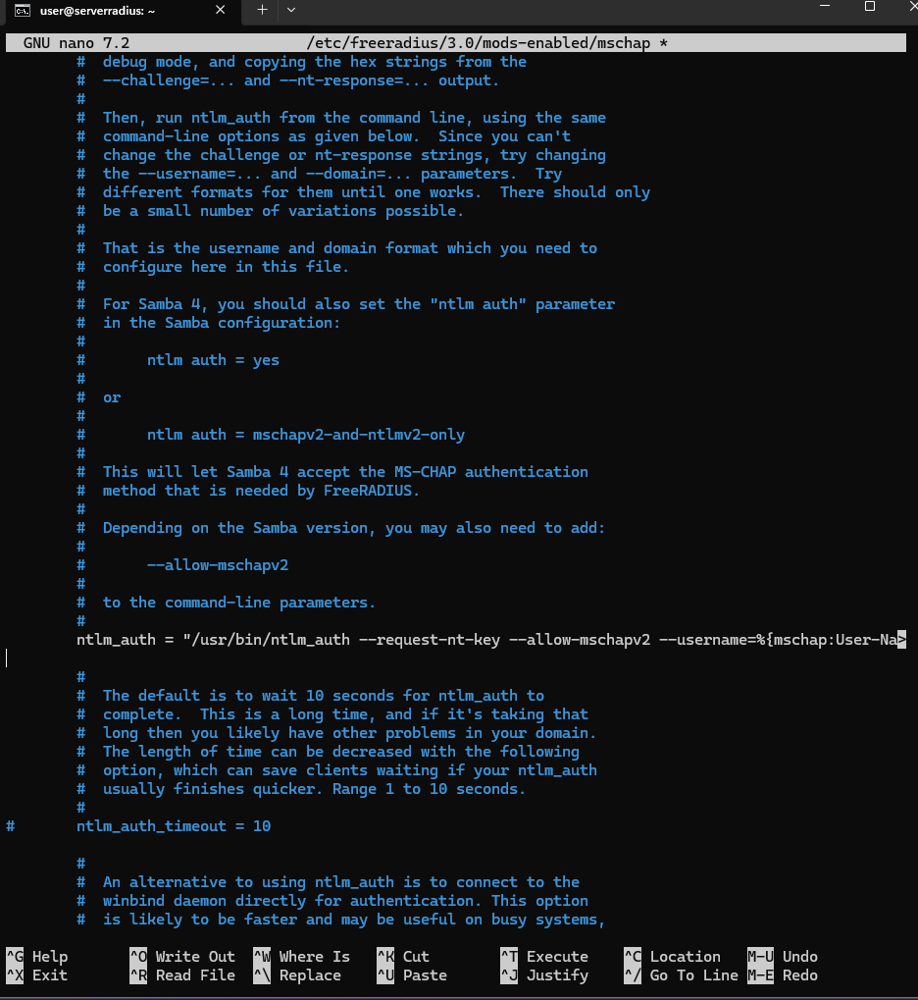

> test de connection avec un utilisateur de l'AD "jbob"

radtest -t mschap jbob "MDP de l'AD" localhost 0 testing123

je n'ai pas réussi à me connecter à cause d'un probleme à priori au niveau de permission:
L'utilisateur qui lance FreeRADIUS (freerad) doit impérativement faire partie du groupe qui possède le droit d'interroger Winbind

sudo gpasswd -a freerad winbindd
sudo systemctl restart winbind
sudo systemctl restart freeradius

retest :

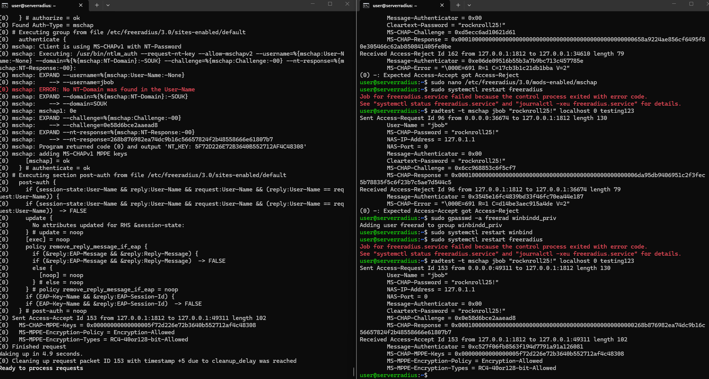

Le serveur FreeRADIUS est désormais parfaitement intégré à ton Active Directory ! 

je relance le service :
user@serverradius:~$ sudo systemctl start freeradius
user@serverradius:~$ sudo systemctl enable freeradius
Synchronizing state of freeradius.service with SysV service script with /usr/lib/systemd/systemd-sysv-install.
Executing: /usr/lib/systemd/systemd-sysv-install enable freeradius

Étape 4 — Configurer le client RADIUS , mettre adresse IP pfense et le secret

sudo nano /etc/freeradius/3.0/clients.conf

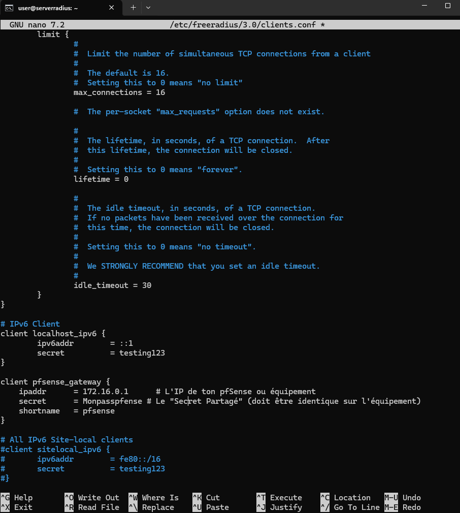

sudo systemctl restart freeradius

configuration sur la pfense : 

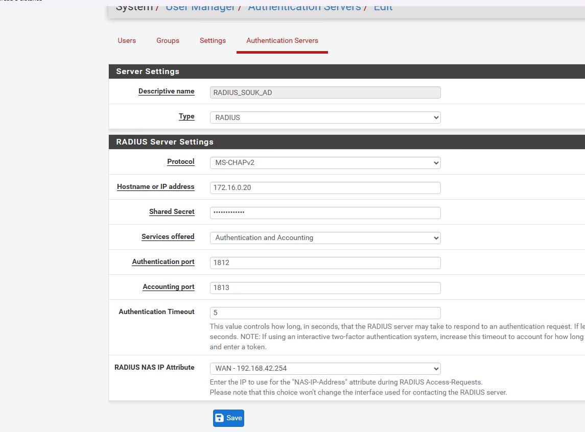

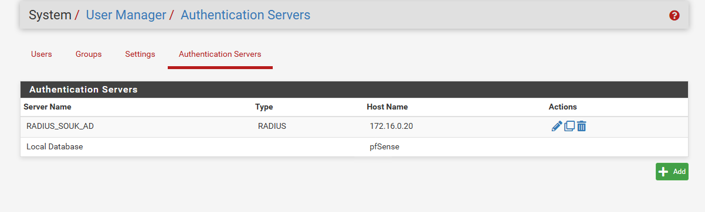

test de d'authenfication depuis la PFsEnse ok 

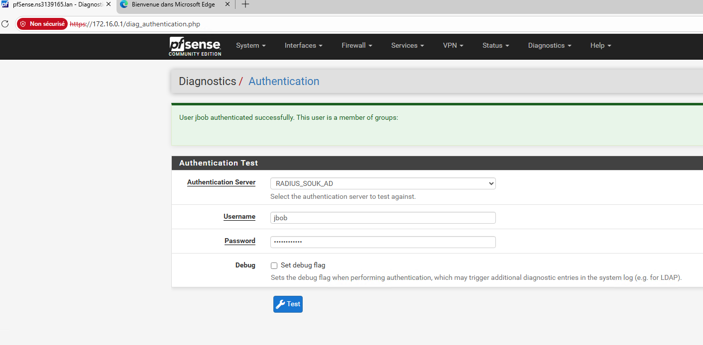

Étape 5 — Tester l’authentification
Un test valide avec un compte AD.
Un test invalide (mauvais mot de passe ou utilisateur absent).

TEst en local ok ! 
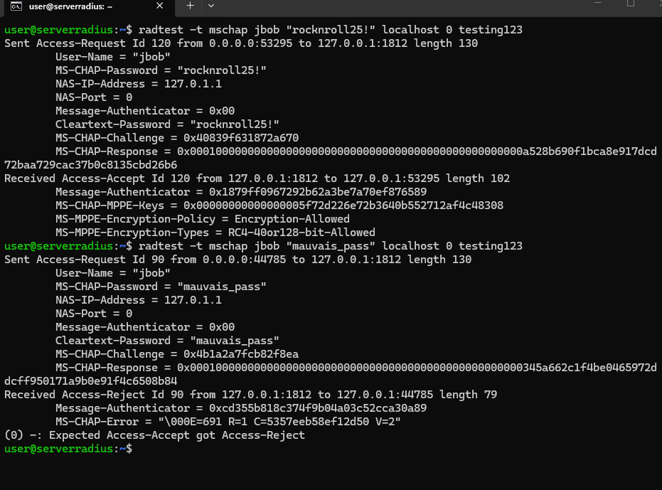

