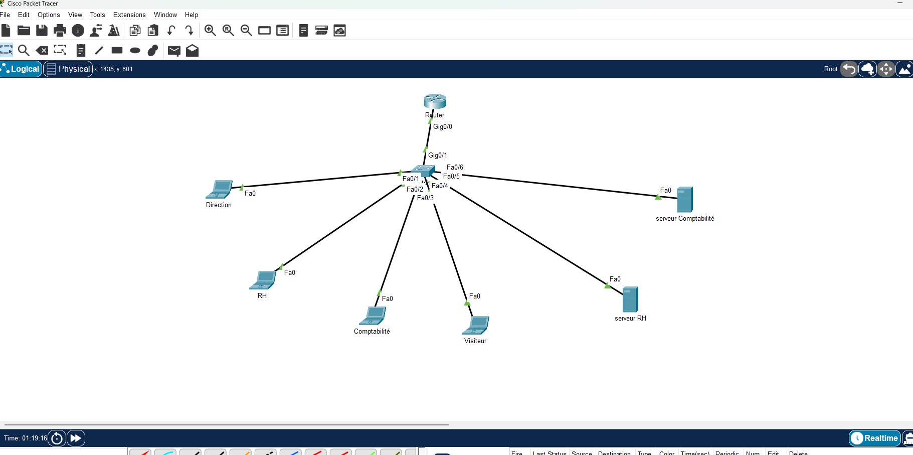
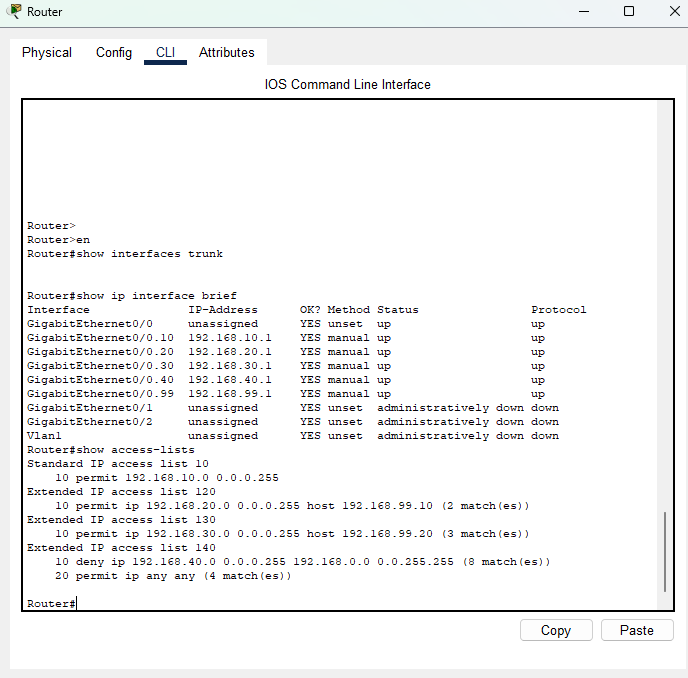
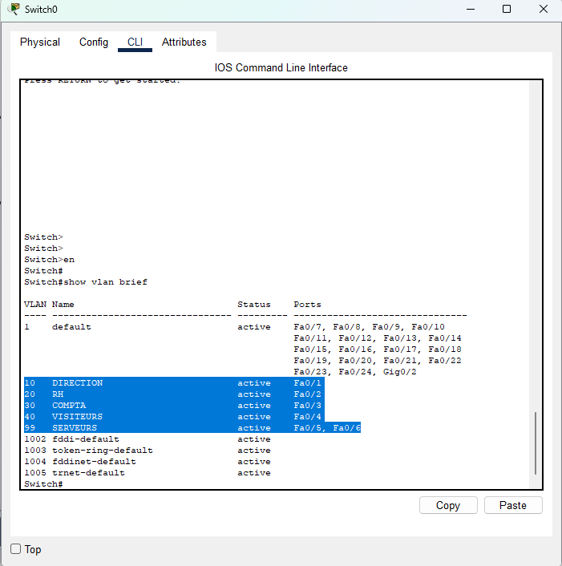
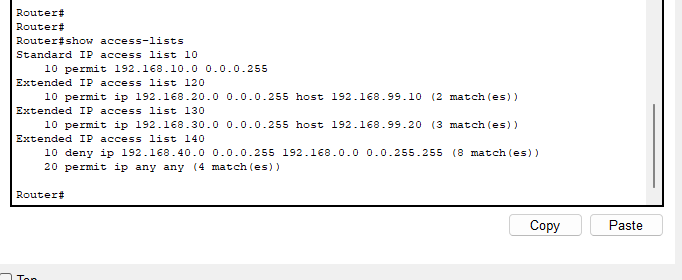
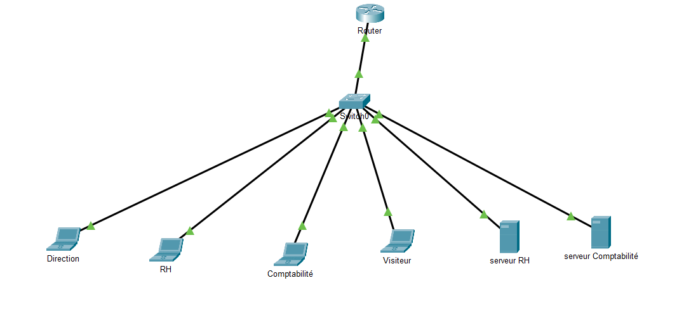

# 🛡️ Challenge — Segmentation VLAN & Contrôle d'accès (ACL)

## 📝 Contexte du Projet
Dans le cadre de mon intervention chez **MédiaSud**, une PME spécialisée dans l'édition numérique, j'ai eu pour mission de sécuriser une infrastructure réseau initialement "plate" (flat network). 

L'audit de sécurité avait révélé des failles majeures :
* **Accès non autorisé** : Des stagiaires pouvaient accéder au serveur de paie.
* **Visibilité accrue** : Les visiteurs Wi-Fi voyaient les partages réseau internes.
* **Administration vulnérable** : Aucune restriction sur l'accès à la configuration des équipements.

**Ma mission :** Segmenter le réseau par service via des VLANs et instaurer une politique de sécurité stricte via des ACL (Access Control Lists).

---

## 🛠️ Environnement Technique
* **Simulateur** : Cisco Packet Tracer v8.x.
* **Routeur** : Cisco 2911 (Routage Inter-VLAN / Router-on-a-Stick).
* **Switch** : Cisco 2960 (Niveau 2).
* **Hôtes** : 2 serveurs (RH, Compta) et 4 PC clients.

---

## 🌐 Plan d'Adressage & Configuration des Hôtes

J'ai structuré le réseau en 5 VLANs distincts. Voici la configuration IP statique que j'ai appliquée sur chaque équipement :

| VLAN | Nom | Réseau | Passerelle | Machine | Adresse IP |
| :--- | :--- | :--- | :--- | :--- | :--- |
| **10** | **DIRECTION** | `192.168.10.0/24` | `192.168.10.1` | **PC-Direction** | `192.168.10.10` |
| **20** | **RH** | `192.168.20.0/24` | `192.168.20.1` | **PC-RH** | `192.168.20.10` |
| **30** | **COMPTA** | `192.168.30.0/24` | `192.168.30.1` | **PC-Compta** | `192.168.30.10` |
| **40** | **VISITEURS** | `192.168.40.0/24` | `192.168.40.1` | **PC-Visiteur** | `192.168.40.10` |
| **99** | **SERVEURS** | `192.168.99.0/24` | `192.168.99.1` | **SRV-RH** | `192.168.99.10` |
| **99** | **SERVEURS** | `192.168.99.0/24` | `192.168.99.1` | **SRV-COMPTA** | `192.168.99.20` |

---

## 🚀 Réalisation par Étapes

### 1. Construction et Câblage
J'ai mis en place la topologie physique en utilisant des câbles droits pour les hôtes et j'ai configuré le lien **Trunk** (802.1Q) entre le Switch0 et le Routeur. Chaque port du switch a été assigné manuellement à son VLAN d'appartenance.

[**ICI Fichier Cisco packet Tracer**](doc/lab_cisco_ACL.pkt)

### 2. Routage Inter-VLAN
J'ai activé le routage entre les réseaux en créant des sous-interfaces logiques sur le routeur. Chaque sous-interface porte l'adresse IP de la passerelle correspondante au VLAN.

### 3. Sécurité de l'Administration (ACL Standard)
Pour protéger l'équipement, j'ai créé une ACL standard (n°10) autorisant uniquement le réseau de la **Direction** à se connecter aux lignes VTY (Telnet/SSH) du routeur.

>Sur le ROUTER

>Sur le SWITCH

### 4. Filtrage Inter-VLAN (ACL Étendues)
J'ai appliqué des règles de filtrage précises sur les interfaces d'entrée du routeur pour respecter la politique du moindre privilège :
* **VLAN RH** : Accès permis uniquement vers le serveur SRV-RH (`192.168.99.10`).
* **VLAN Compta** : Accès permis uniquement vers le serveur SRV-COMPTA (`192.168.99.20`).
* **VLAN Visiteur** : Blocage total vers le réseau interne et autorisation vers l'extérieur uniquement.

---

## ✅ Tests de Validation

Les tests ont été effectués par ping et les résultats sont confirmés par les compteurs de "matches" visibles sur le routeur.

| # | Test | Source | Destination | Attendu | État |
| :--- | :--- | :--- | :--- | :--- | :--- |
| **1** | Ping | Direction | 192.168.99.10 | ✅ Succès | Passé |
| **2** | Ping | Direction | 192.168.99.20 | ✅ Succès | Passé |
| **3** | Ping | RH | 192.168.99.10 | ✅ Succès | Passé (2 matches) |
| **4** | Ping | RH | 192.168.99.20 | ❌ Échec | Bloqué |
| **5** | Ping | Compta | 192.168.99.20 | ✅ Succès | Passé (3 matches) |
| **6** | Ping | Compta | 192.168.99.10 | ❌ Échec | Bloqué |
| **7** | Ping | Visiteur | 192.168.99.x | ❌ Échec | Bloqué (8 matches) |
| **8** | Ping | Visiteur | 8.8.8.8 | ✅ Succès | Passé (4 matches) |
| **9** | Telnet | Direction | 192.168.10.1 | ✅ Succès | Passé |
| **10**| Telnet | RH/Visiteur | Routeur | ❌ Échec | Bloqué |

---

## 📄 Conclusion
Ce projet m'a permis de valider la mise en place d'une architecture réseau sécurisée. L'isolation par VLAN couplée aux ACL permet de répondre efficacement aux exigences métier tout en garantissant la confidentialité des données sensibles de l'entreprise.

