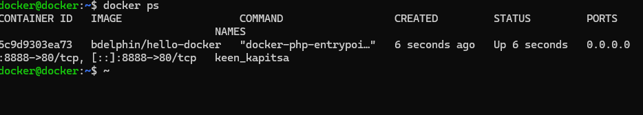
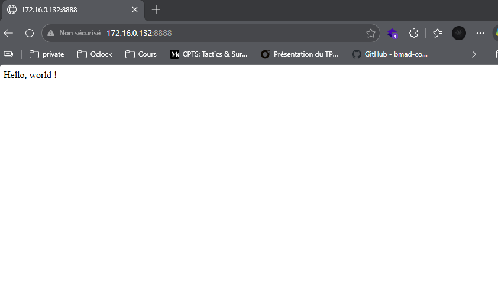

# Challenge — Intégration RADIUS & Active Directory

##  Exercice : bases de la CLI Docker

### Étape #1 et #2 : Mon premier conteneur et le lancer en tâche de fond

1. création d'un conteneur : 

2. connection sur la page web du conteneur: 

