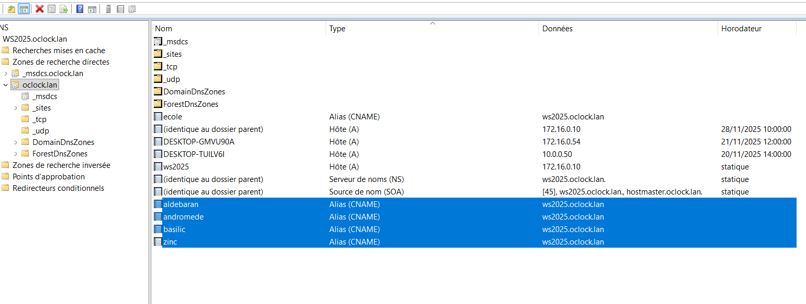
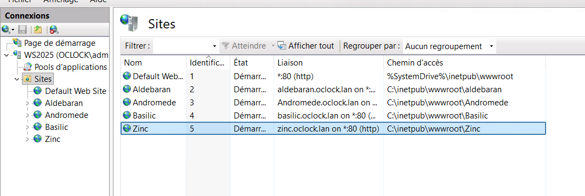
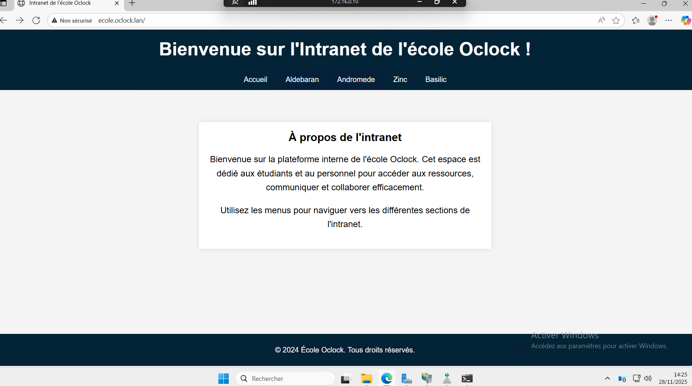
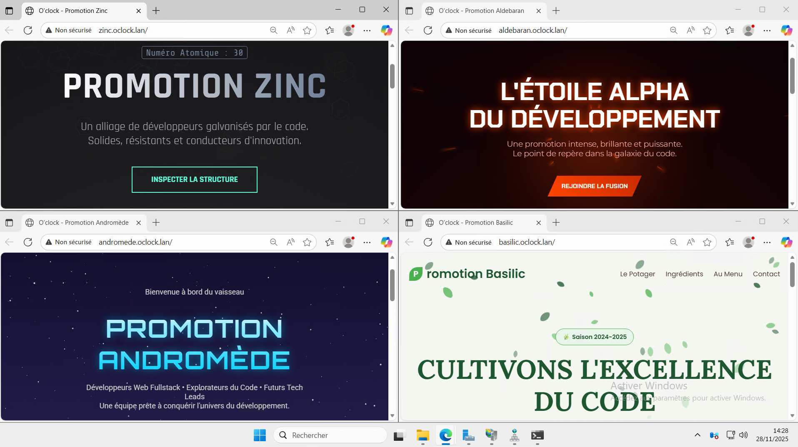

# SA4E08 - Challenge DNS & serveur web IIS 

### 1- Création des 4 dossiers dans wwwroot

### 2- Création de 4 alias CNAME
> Nom de domaine : ws2025.oclock.lan

### 3- Création des 4 sites sur le Gestionnaire de services internets (IIS)

### Voici le rendu :

> Page principale du site 

> les 4 pages pour chaque promotions

