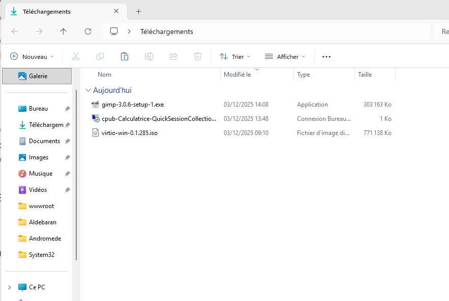
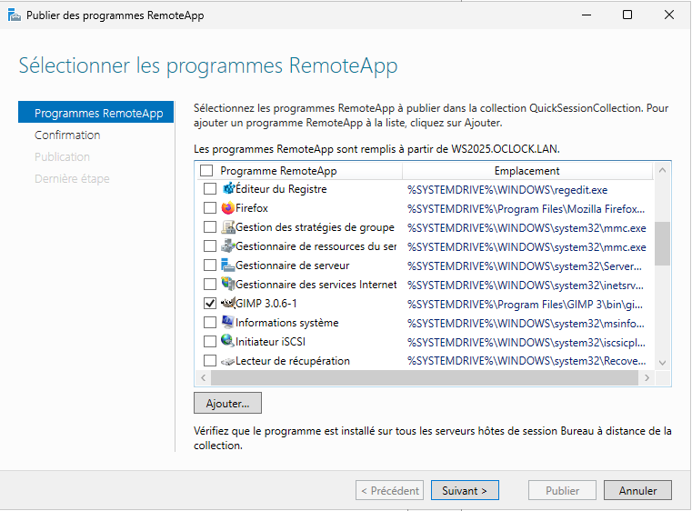
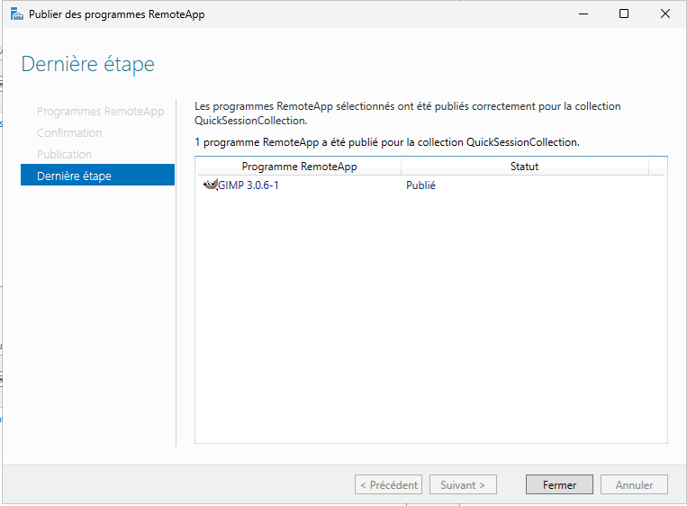
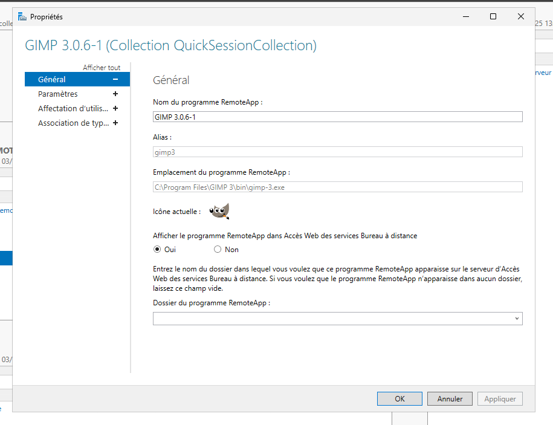
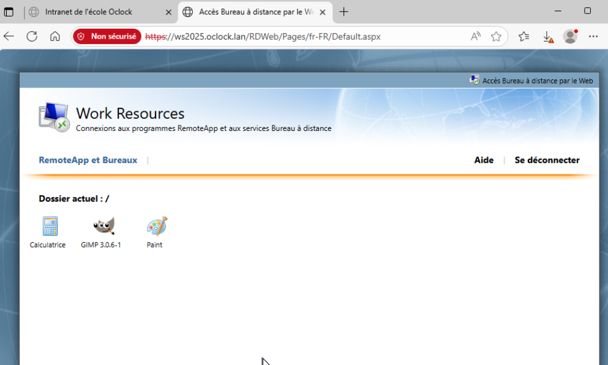
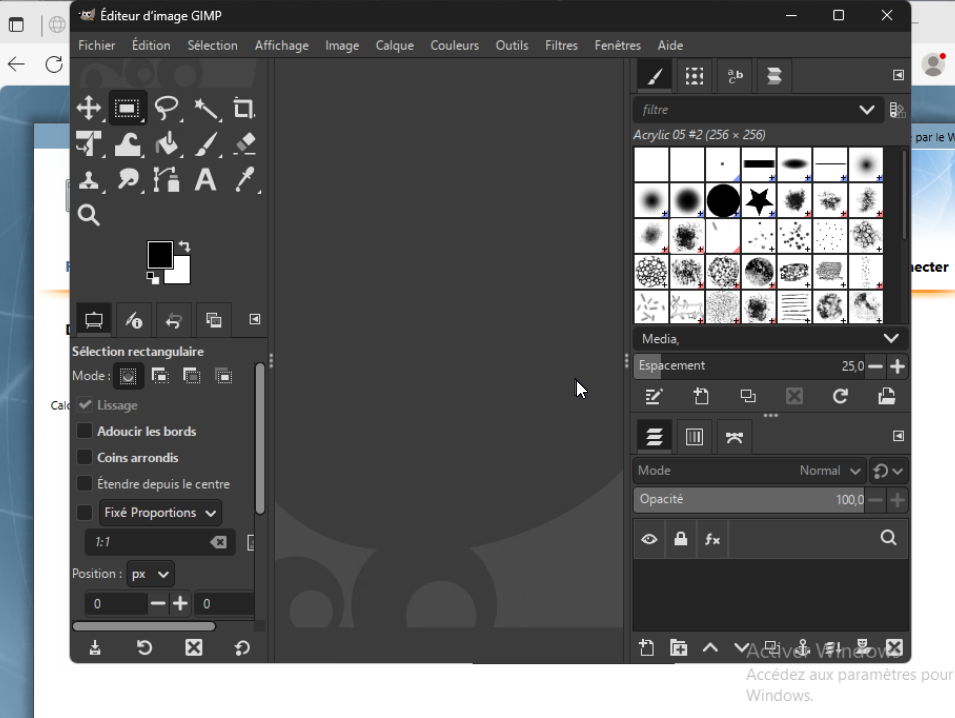

# SA4E08 - Challenge RDS

## Challenge : RDS

## ⌨️ Challenge

Installer GIMP et la publier pour les sessions utilisateurs en RemoteAPP via le serveur RDS

### 1- ✔️ Telechargement et installation de l'application GIMP

### 2- ✔️ Publication de l'application GIMP 

### 3- ✔️ Connection sur le client Windows , l'application 

