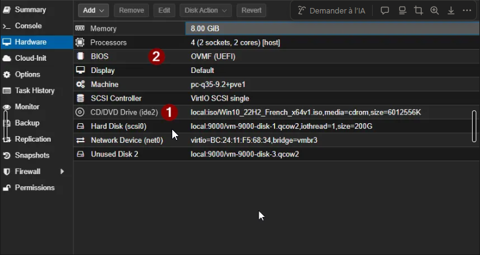
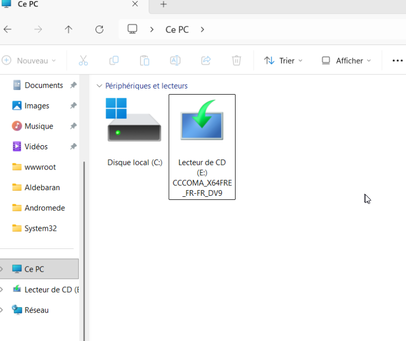
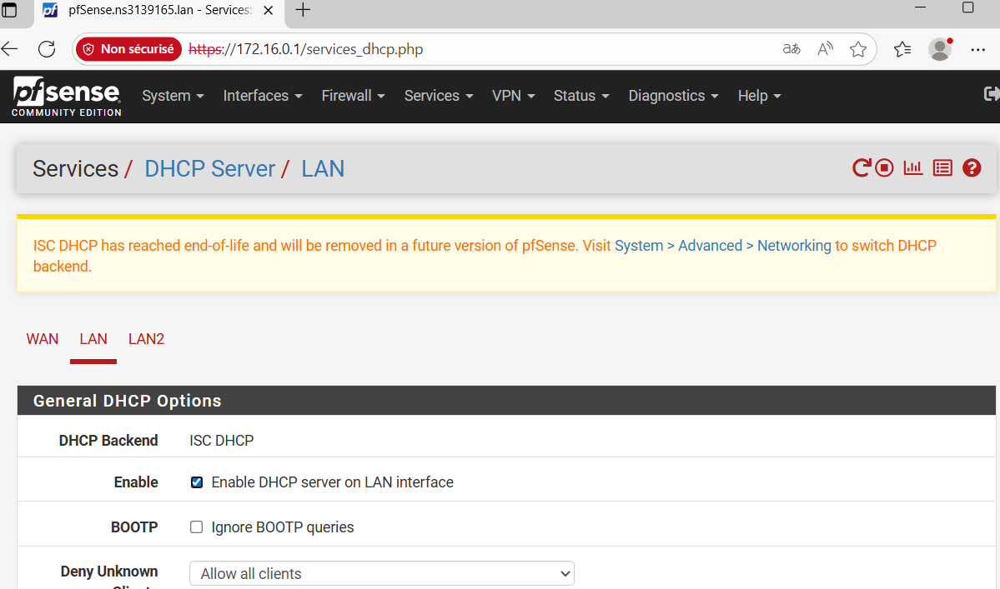
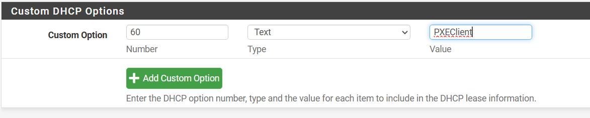
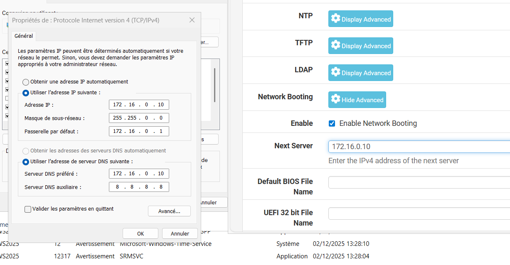
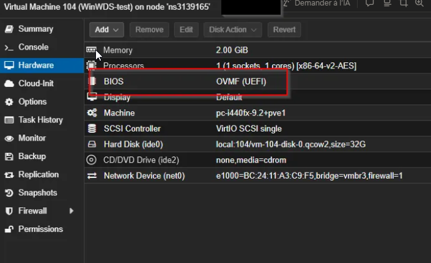
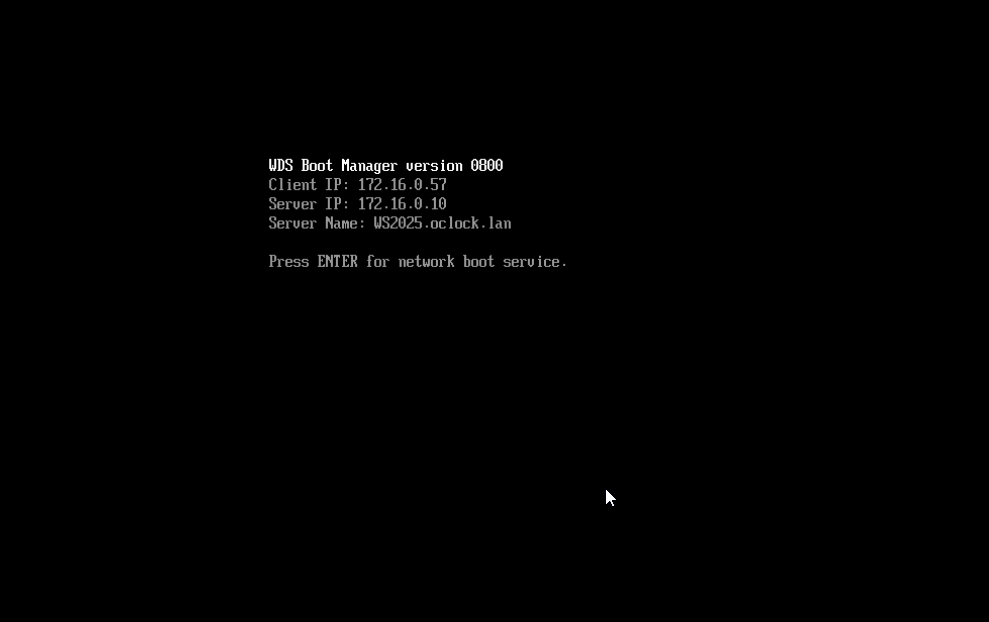

# SA4E08 - Challenge WSB AD 

## Challenge : Windows Deployment Services

## ⌨️ Challenge

- Ajouter une image de démarrage Windows 10 dans WDS à partir d’un ISO.
- Ajouter une image d’installation Windows 10 et vérifier sa présence dans les groupes WDS.
- Tester un boot PXE sur une VM et observer les étapes de connexion au serveur WDS.
- Activer ou vérifier l’Option 60 si DHCP et WDS sont sur le même serveur.

📌 Pré-requis

Un serveur Proxmox (VIRTUALISATION)

Un serveur WDS 

Un DHCP configuré pour le PXE dans notre cas un pfense

Une ISO dans notre cas un windows 10

Une machine vierge en UEFI pour tester le boot PXE UEFI

### 1- ✔️ Ajout du CD/DVD Drive dans Proxmox

### 2- ✔️ Configuration du DHCP pfSense pour le WDS (PXE), choisir le bon lan.

### 3- ✔️ Activer le Network Booting et Indiquer l’adresse du serveur WDS sur le panel admin pfsense

### 4- ✔️ Création d’une VM vierge pour le test PXE

📌 Options à vérifier :

Boot Order → Network (PXE) en premier

Machine en mode UEFI obligatoire

Réseau : même vlan / bridge que WDS

### 4- ✔️ Démarrage de la machine virtuelle 

