# Procédure d'installation de VCenter (VCSA)

## 1. Préparation et Lancement
* **Montage de l'image** : Faire un double-clic sur le fichier ISO de vCenter pour le monter.
* **Accès à l'installeur** : Naviguer dans le répertoire suivant :
    `E:\vcsa-ui-installer\win32`
* **Exécution** : Lancer le fichier `installer.exe`.

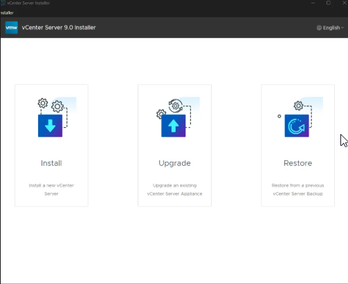

---

## 2. Étape 1 : Déploiement de l'appareil (Stage 1)

### Introduction et Licence
1. Cliquer sur **Next** sur l'écran d'accueil.
2. Accepter le contrat de licence (EULA) et cliquer sur **Next**.

### Configuration de l'ESXi cible
Indiquez l'hôte sur lequel la VM vCenter sera déployée :
* **IP du serveur ESXi** : `172.16.0.100`
* **Nom d'utilisateur** : `root`
* **Mot de passe** : `XXXX`

*Note : Validez le certificat de sécurité qui s'affiche.*

> **Attention** : Si l'adresse IP s'affiche en rouge, effacez-la et retapez-la manuellement (problème fréquent de caractères invisibles).

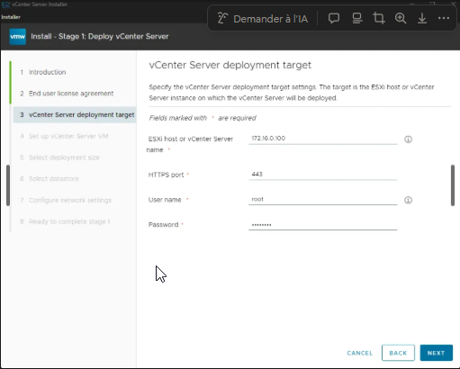

### Paramètres de la VM vCenter
* Définir le **nom de la machine** et le **mot de passe root**.
* Cliquer sur **Next**.

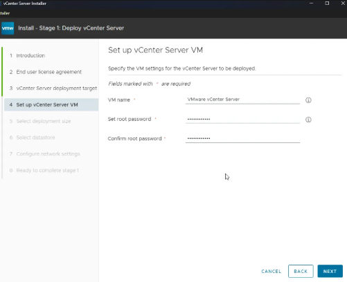

### Taille du déploiement
* **Choix** : `Tiny` (C'est l'option la plus basse, elle définit les ressources CPU/RAM allouées).
* Laisser par défaut et cliquer sur **Next**.

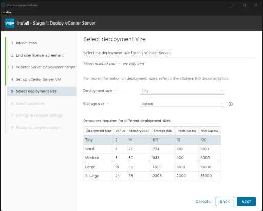

### Sélection du Datastore
* Sélectionner le datastore où installer la VM.
* **Option Disk Mode** : Cocher **"Enable Thin Disk Mode"** pour ne consommer que l'espace nécessaire (allocation dynamique).

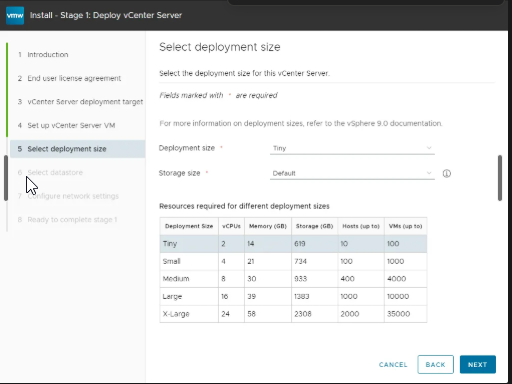

* *Info : On peut aussi choisir un stockage de type VSAN pour la mutualisation.*

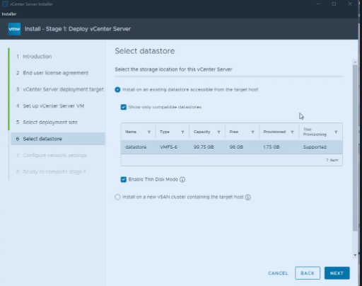

### Configuration du réseau
* Configurer l'adresse IP fixe pour le vCenter.
* **IP dédiée** : `172.16.0.101`
* (Pensez à remplir le masque, la passerelle et le DNS selon votre réseau).

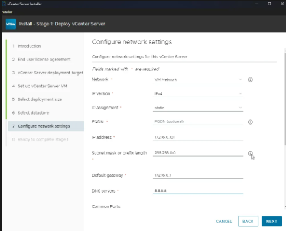

### Déploiement du serveur.

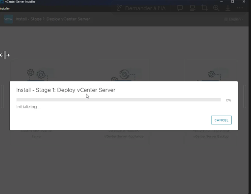

---

## 3. Fin du Stage 1
Le déploiement de l'appareil est lancé. Une fois la barre de progression terminée, le Stage 1 est validé, noté l'adresse qui est indiqué à la fin du stage 1.

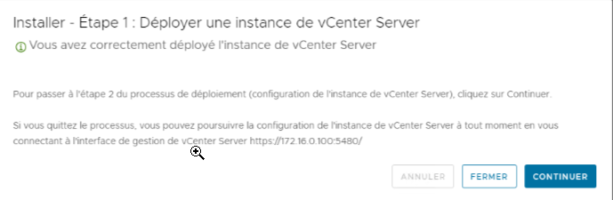

## 4. Étape 2 : Configuration de l'appareil (Stage 2)

### Ouverture de la console de la VM VMware Vcenter Server 

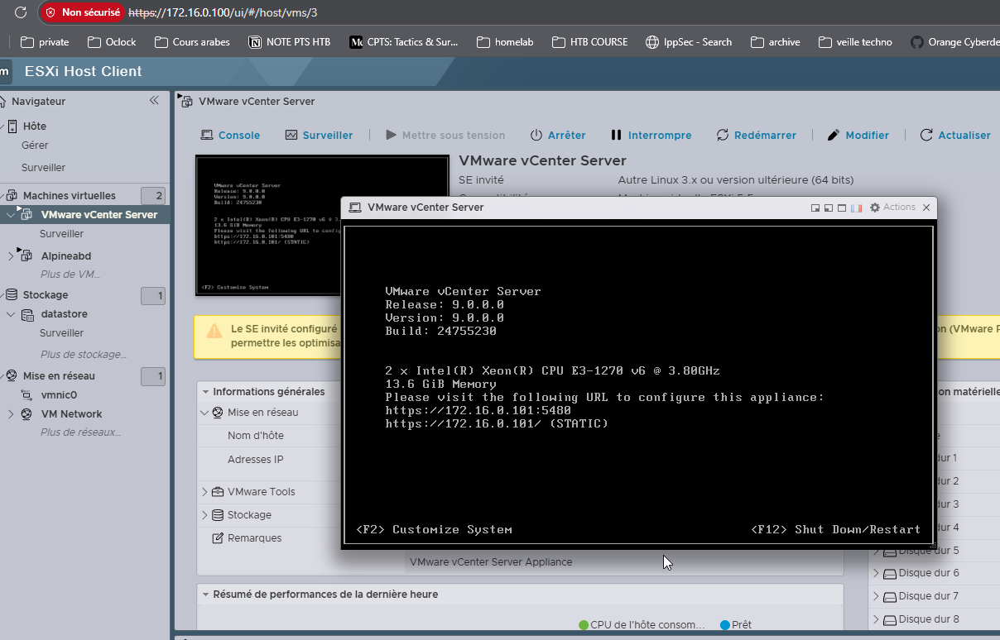

### Ouverture de la page de la VM VMware Vcenter Server et cliquer sur installation

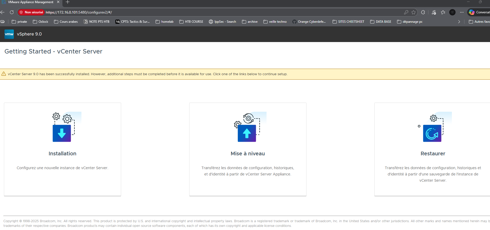

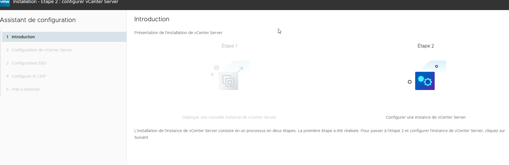

### verifier que les paramètres sont corrects : 

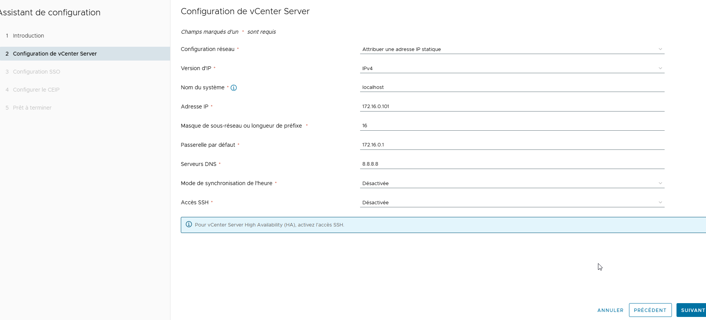

### configuration du SSO Vcenter : 

* *Info : Le SSO de Vcenter est un SSO intégré avec son propre domaine car les différentes briques "déploiement, stockages, inventaires..." doivent pouvoir s'authentifier entre elles .*

* MEttre le même domaine
* Choisir un mot de passe

### Configurer le CEIP , au choix , si du test, pas besoin : 

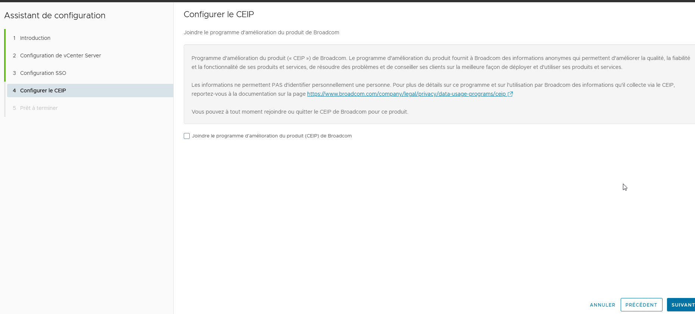

### verifier que les paramètres sont corrects 

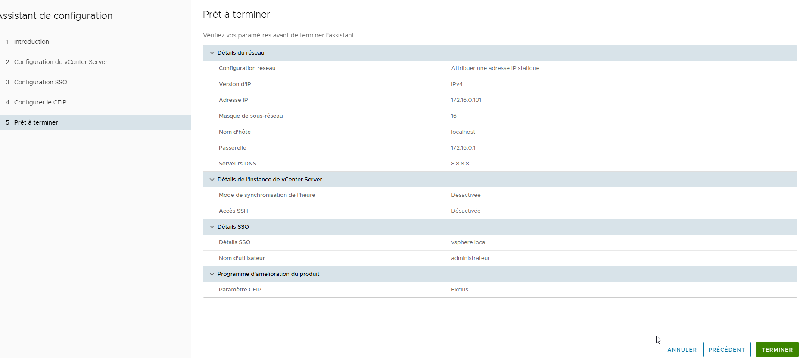

### lancer la configuration du stage 2 : 

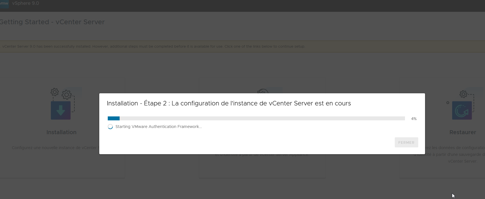

### Fin de configuration du stage 2 : 

### Lancement de VSPHERE CLIENT , utiliser les logins du SSO : 

* nom de domain: XXXXX
* login :administrator@NOMDUDOMAIN
* mdp : XXXXXXX

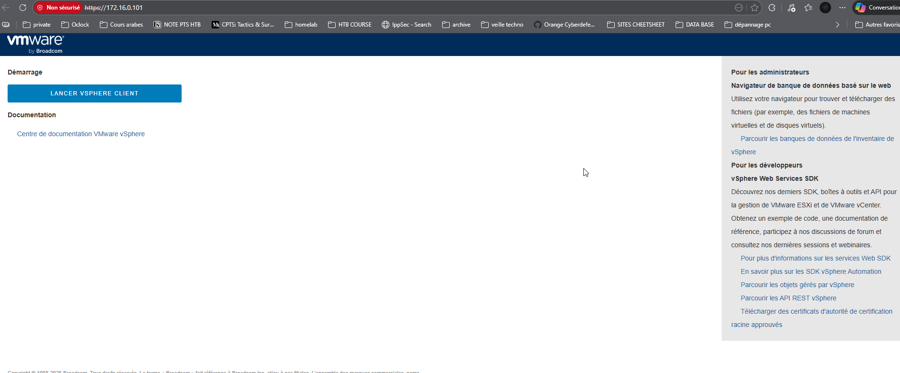

### Fin du stage 2  : 

* appliance de management joignable et fonctionnelle

* console d'administration de VCENTER joignable et fonctionnelle

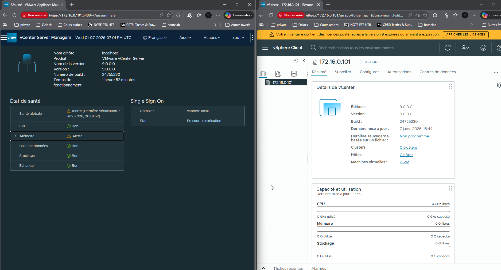