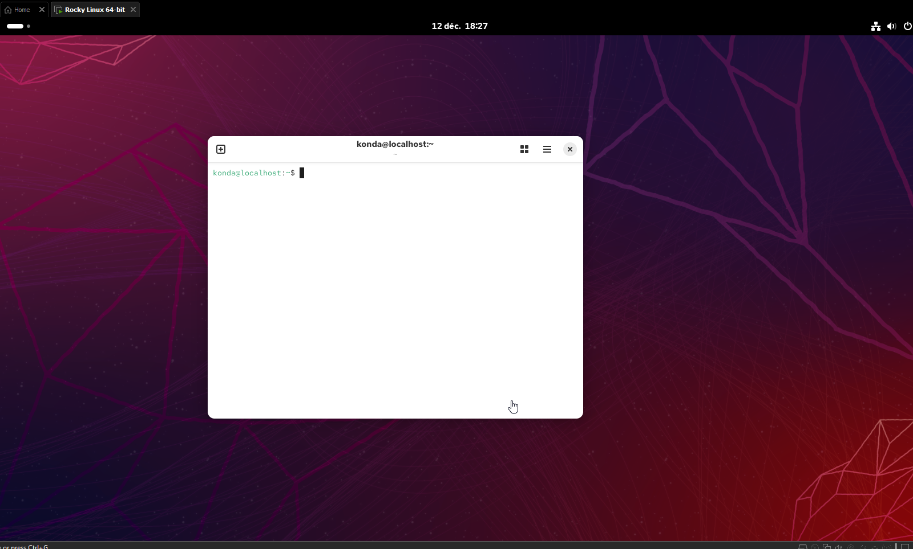
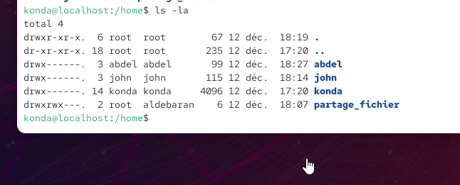
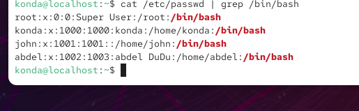
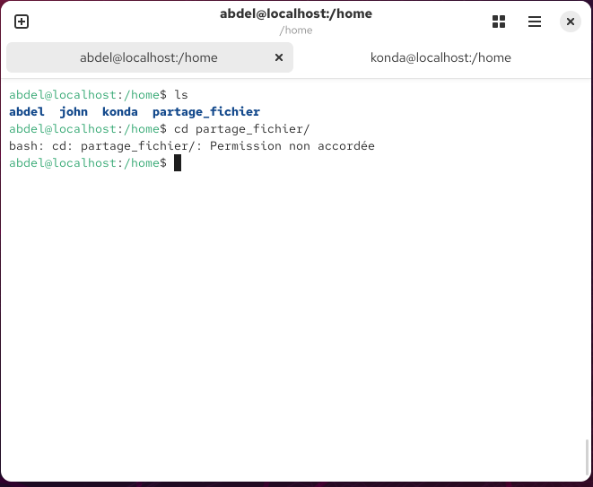

# SA5E02 - Administration


## Challenge : 

> Pour pratiquer les notions du jour, votre mission est d’installer une VM Rocky Linux (le successeur de CentOS, la version communautaire de Red Hat Entreprise Linux).
Sur cette VM, vous devez :
1. créer un nouvel utilisateur
2. permettre à cet utilisateur de lancer des commandes avec sudo
3. faire en sorte qu’aucun mot de passe ne soit demandé pour lancer la commande rpm
4. créer un groupe, mettre le nouvel utilisateur et l’utilisateur créé lors de l’installation dans ce groupe
5. créer un dossier /home/partage_fichier et modifier ses permissions pour que les membres du groupe créé précédemment aient les droits de lecture et d’écriture, mais qu’aucun autre utilisateur du système n’y ait accès.
6. créer un dernier utilisateur et vérifier qu’il n’a pas accès au dossier créé précédemment

### RESOLUTION DU CHALLENGE : 

Télechargement de Rocky Linux via le site web :
[SITE WEB ROCKY LINUX ](https://rockylinux.org/fr-FR)

Installation de l'iso sur VM-Ware



1. créer un nouvel utilisateur et mettre un mot de passe

```bash
sudo useradd -m -s /bin/bash john

cat /etc/passwd 

john:x:1001:1001::/home/john:/bin/bash

Sudo passwd john 
test1234
test1234

```

> l'utisateur john est bien crée est présent dans le fichier /etc/passwd et son mot de passe est crée

2. permettre à cet utilisateur de lancer des commandes avec sudo

```bash
john@localhost:/home/konda$ sudo -l
Désolé, l'utilisateur john ne peut pas utiliser sudo sur localhost.
john@localhost:/home/konda$ 
```

> rajout de l'utisateur dans le groupe sudo pour qu'il puisse utiliser sudo 
```bash
root@localhost:/home/konda# id konda
uid=1000(konda) gid=1000(konda) groupes=1000(konda),10(wheel)
root@localhost:/home/konda# usermod -aG sudo
usermod : le groupe 'sudo' n'existe pas

root@localhost:/home/konda# usermod -aG wheel john
root@localhost:/home/konda# id john
uid=1001(john) gid=1001(john) groupes=1001(john),10(wheel)

```
> Visiblement dans cette distribution de linux , le groupe sudo n'existe pas et est remplacé par wheel.

```bash
john@localhost:/home/konda$ rpm
RPM version 4.19.1.1
Copyright © 1998-2002 - Red Hat, Inc.
Ce programme peut être librement redistribué sous les termes de la licence GNU GPL

Utilisation : rpm [-afgpqlsiv?] [-a|--all] [-f|--file] [--path]
        [-g|--group] [-p|--package] [--pkgid] [--hdrid] [-q|--query]
        [--triggeredby] [--whatconflicts] [--whatrequires] [--whatobsoletes]
        [--whatprovides] [--whatrecommends] [--whatsuggests]
        [--whatsupplements] [--whatenhances] [--nomanifest]
        [-c|--configfiles] [-d|--docfiles] [-L|--licensefiles]
        [-A|--artifactfiles] [--noghost] [--noconfig] [--noartifact]
        [--dump] [-l|--list] [--queryformat=QUERYFORMAT] [-s|--state]
        [--nofiledigest] [--nofiles] [--nodeps] [--noscript] [--allfiles]
        [--allmatches] [--badreloc] [-e|--era

```

3. faire en sorte qu’aucun mot de passe ne soit demandé pour lancer la commande rpm

```bash
john@localhost:/home/konda$ sudo rpm
RPM version 4.19.1.1
Copyright © 1998-2002 - Red Hat, Inc.
Ce programme peut être librement redistribué sous les termes de la licence GNU GPL

Utilisation : rpm [-afgpqlsiv?] [-a|--all] [-f|--file] [--path]
```

4. créer un groupe, mettre le nouvel utilisateur et l’utilisateur créé lors de l’installation dans ce groupe

création d'un groupe :

```bash
john@localhost:/home/konda$ sudo groupadd aldebaran
```
rajout des deux users dans le nouveau groupe aldebaran 

```bash
john@localhost:/home/konda$ sudo usermod -aG aldebaran john
john@localhost:/home/konda$ sudo usermod -aG aldebaran konda

john@localhost:/home/konda$ id konda
uid=1000(konda) gid=1000(konda) groupes=1000(konda),10(wheel),1002(aldebaran)
john@localhost:/home/konda$ id john
uid=1001(john) gid=1001(john) groupes=1001(john),10(wheel),1002(aldebaran)
john@localhost:/home/konda$ 
```

5. créer un dossier /home/partage_fichier et modifier ses permissions pour que les membres du groupe créé précédemment aient les droits de lecture et d’écriture, mais qu’aucun autre utilisateur du système n’y ait accès



```bash
john@localhost:/home/konda$ sudo mkdir /home/partage_fichier
john@localhost:/home/konda$ cd /home/partage_fichier/
john@localhost:/home/partage_fichier$ 
```

```bash
john@localhost:/home$ ls -l
drwxr-xr-x.  2 root  root     6 12 déc.  18:07 partage_fichier

john@localhost:/home$ sudo chgrp aldebaran partage_fichier/
john@localhost:/home$ sudo chmod g+rwx partage_fichier/
john@localhost:/home$ chmod o= partage_fichier/
```
> j'ai rajouté le groupe aldebaran au fichier avec le full autorisation peut les gens du groupe et retrait des autorisations pour les autres users.

6. créer un dernier utilisateur et vérifier qu’il n’a pas accès au dossier créé précédemment



création de l'user abdel et d'entrée dans le dossier partage_fichier

```bash
john@localhost:/home$ sudo useradd -m -s /bin/bash -c "abdel DuDu" abdel
john@localhost:/home$ id abdel
uid=1002(abdel) gid=1003(abdel) groupes=1003(abdel)
john@localhost:/home$ 
abdel@localhost:/home$ cd partage_fichier/
bash: cd: partage_fichier/: Permission non accordée
```

