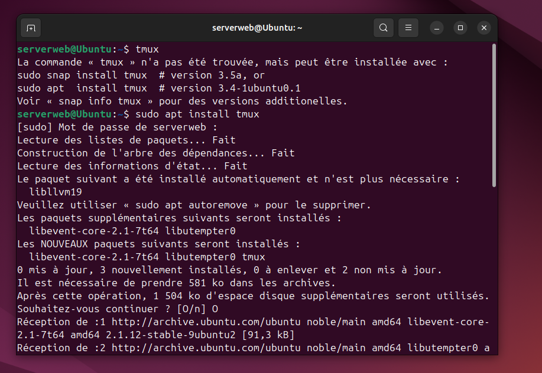
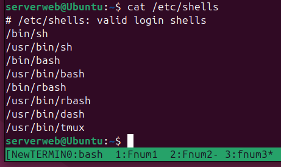
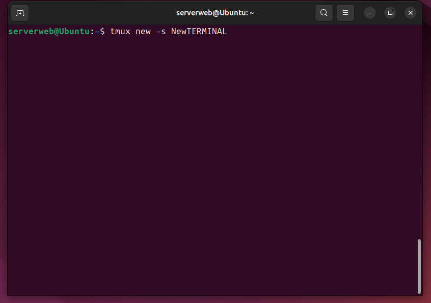
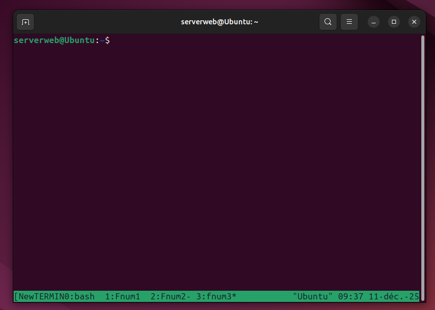
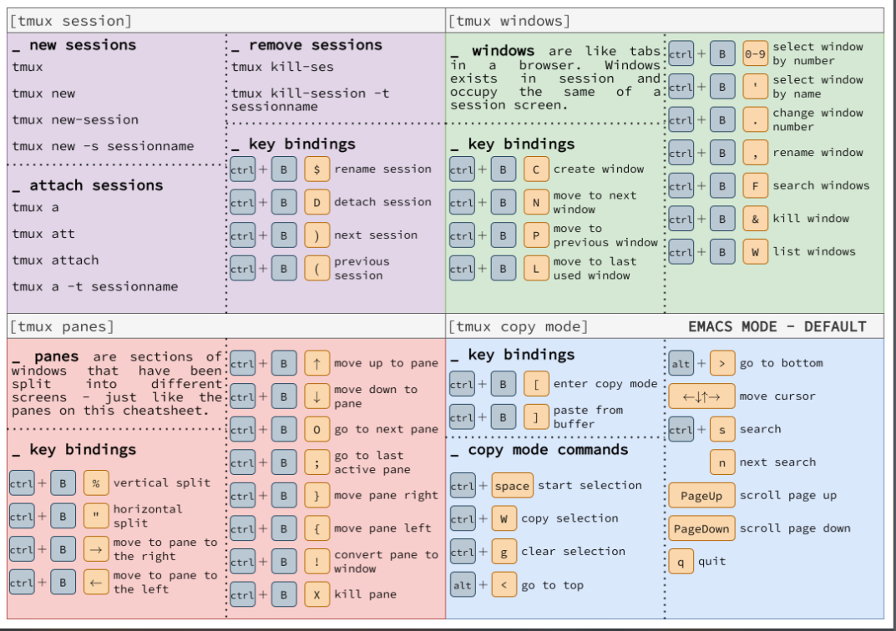

# SA5E02 - Composants!

## Challenge : Briques

1. installation de TMUX 
> Tmux est un outil qui permet aux utilisateurs de créer plusieurs sessions virtuelles de terminal dans leur système

2. création d'une session TMUX nommé NewTERMINAL

3. création de trois fenetres Fnum1,Fnum2 et Fnum3

### CHEATSHEET

> raccourci permettant l'utilisation de TMUX

