# SA5E02 - SB1E01 - Introduction

## Installation de Proxmox VE sur VMware Workstation

### 1. Configuration de la machine virtuelle
Voici la configuration initiale de la machine :

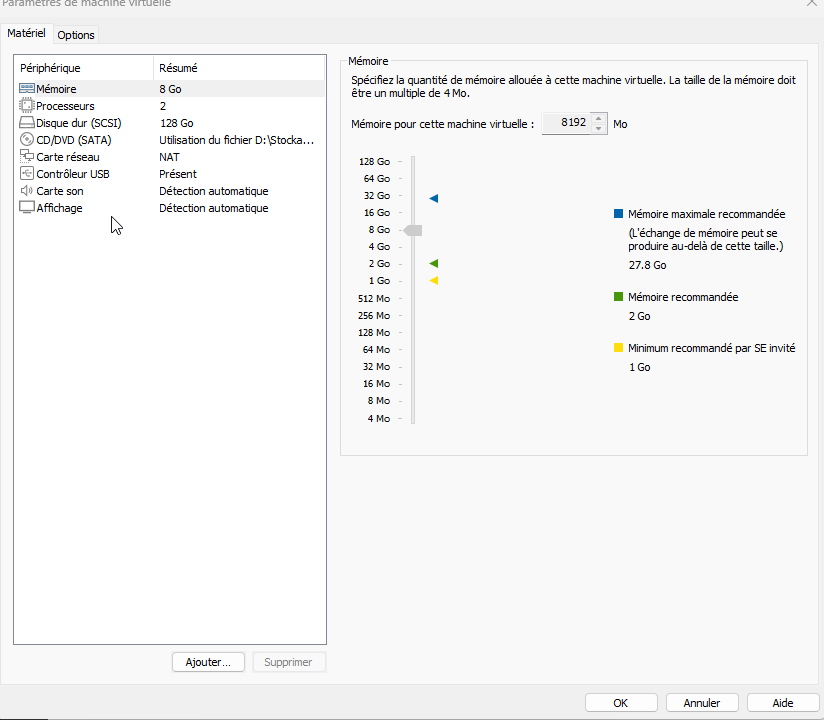

> [!IMPORTANT]
> **Virtualisation imbriquée :** Vous devez impérativement cocher l'option **"Virtualize Intel VT-x/EPT or AMD-V/RVI"** pour permettre à Proxmox d'exécuter des machines virtuelles à son tour.

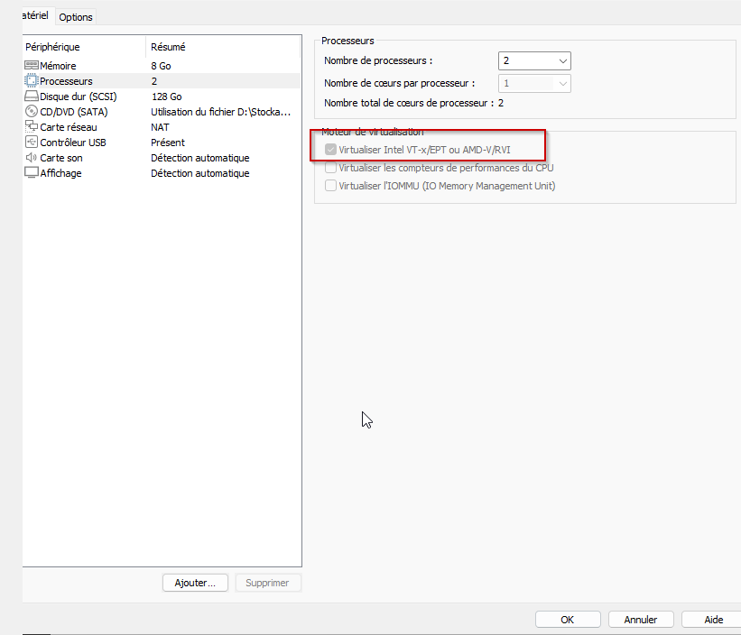

---

### 2. Lancement et installation
Démarrage du processus d'installation :

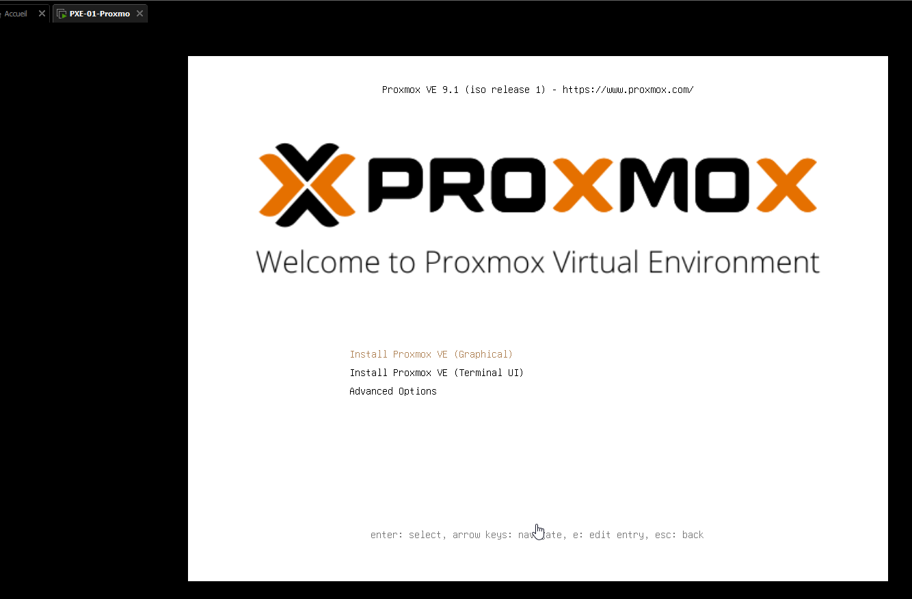

Une fois les étapes franchies, l'installation se termine :

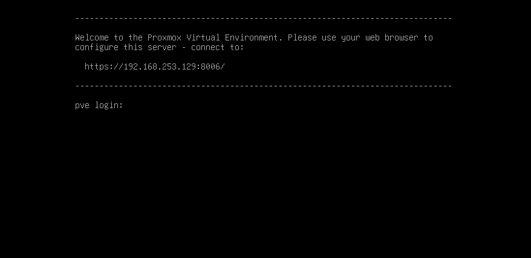

---

### 3. Résultat 
L'installation de **Proxmox** est réussie et l'interface console est visible via 2 machines du réseau différentes :

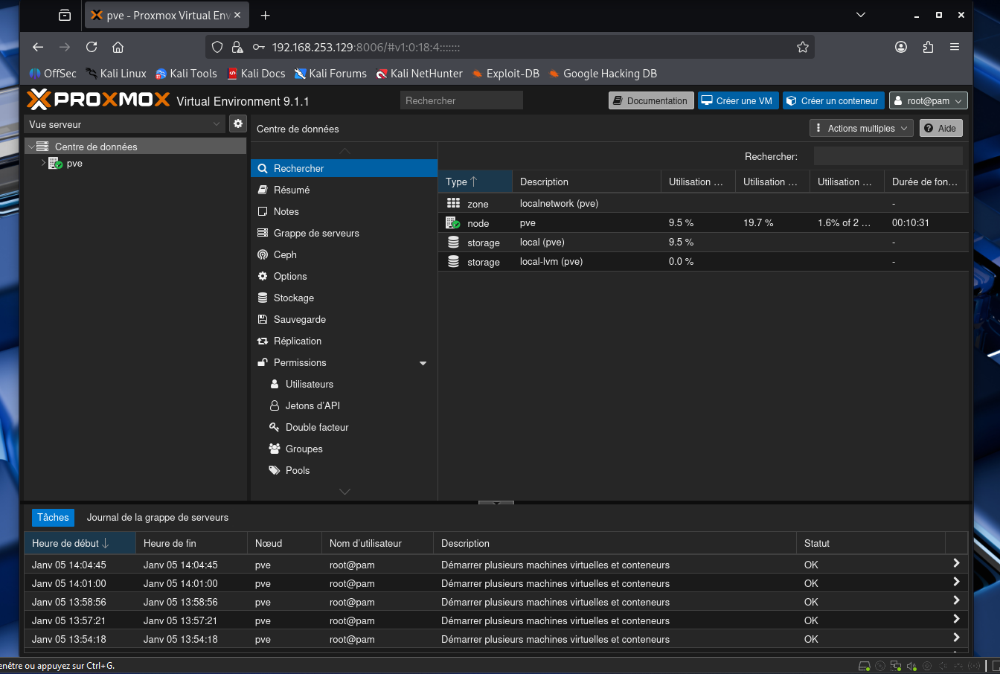

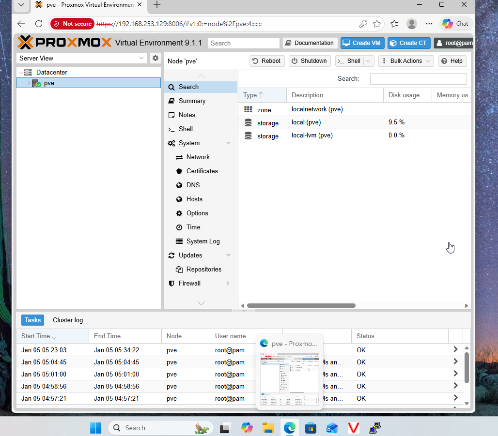

### 4.Mise à jour :

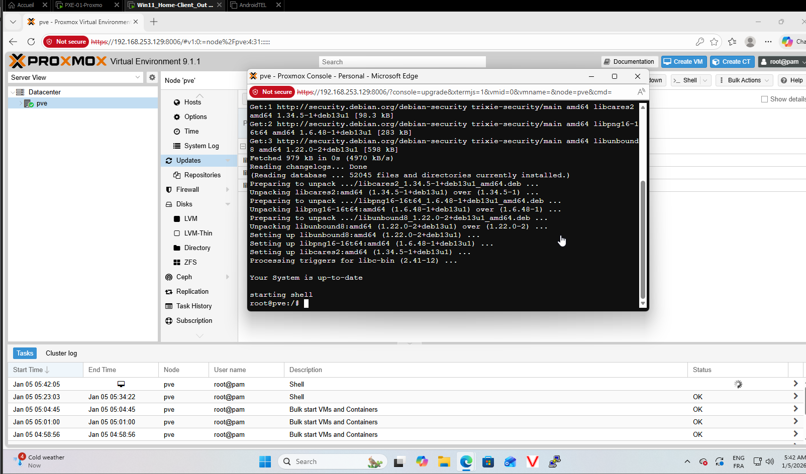

## 5. Importation d'un fichier ISO sur proxmox

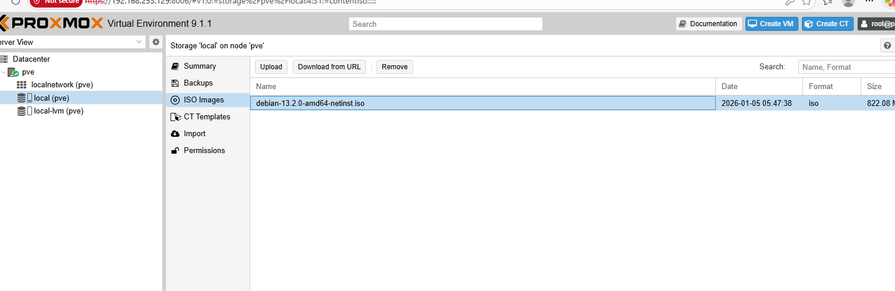

## 6. Création d'un USER : UserProx1 et connection avec celui-ci

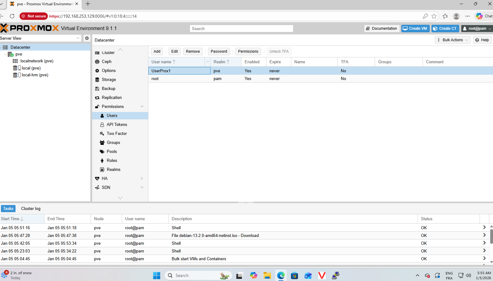

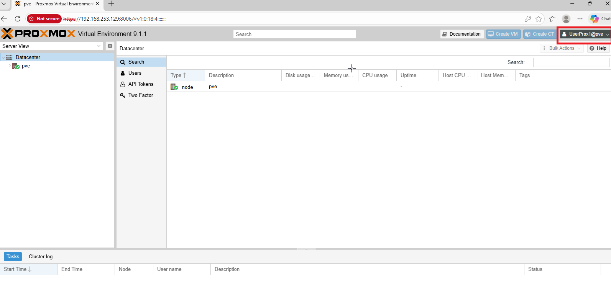

## 7. installation d'un second proxmox 

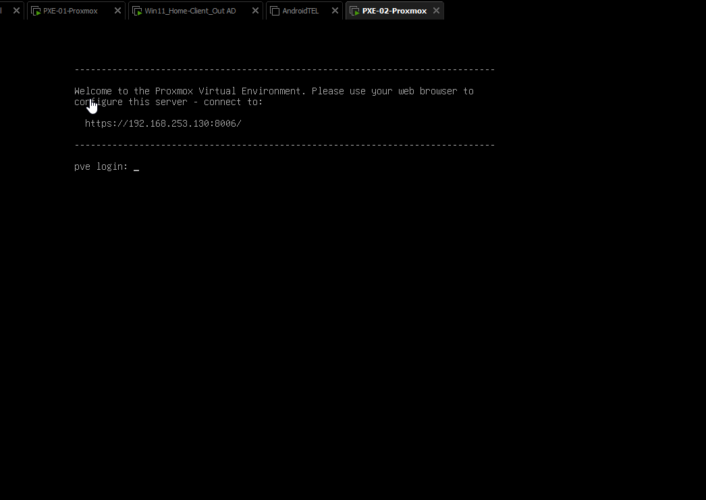

## 8. Test de connectivité entre les 2 serveurs PROXMOX , ok

## 🖥️ Serveur Proxmox 1
- **Rôle :** Hyperviseur Principal
- **URL d'administration :** [https://192.168.253.129:8006/]
- **Configuration réseau :**
    - **Adresse IP :** `192.168.253.129`
    - **FQDN :** `pve.localdomain`
    - **Hostname :** `pve`
    - **Domaine :** `localdomain`

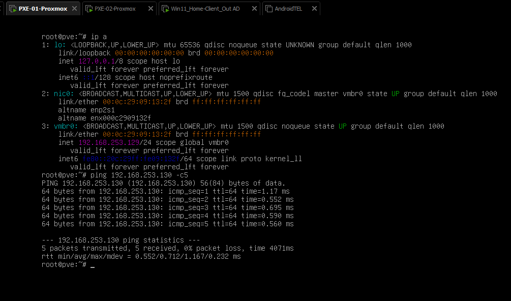

## 🖥️ Serveur Proxmox 2
- **Rôle :** Hyperviseur Secondaire
- **URL d'administration :** [https://192.168.253.130:8006/](https://192.168.253.130:8006/)
- **Configuration réseau :**
    - **Adresse IP :** `192.168.253.130`
    - **FQDN :** `pve.2.local`
    - **Hostname :** `pve`
    - **Domaine :** `2.local`

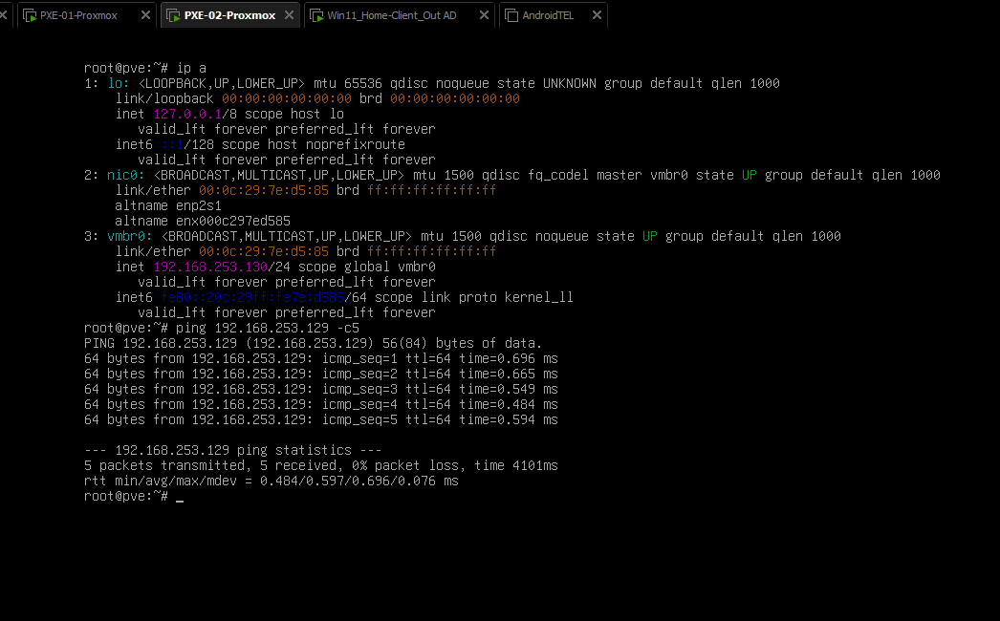

## 9. Final , connection ok sur les 2 panels web des deux proxmox.

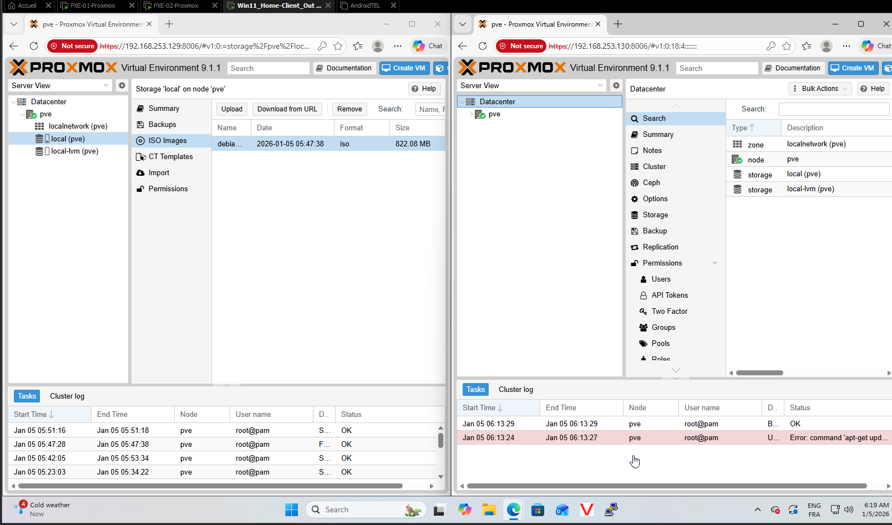