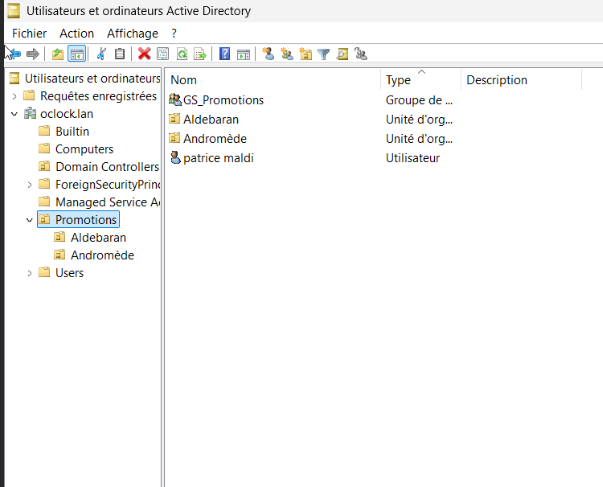
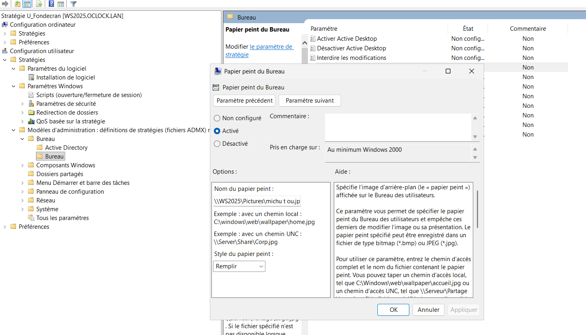
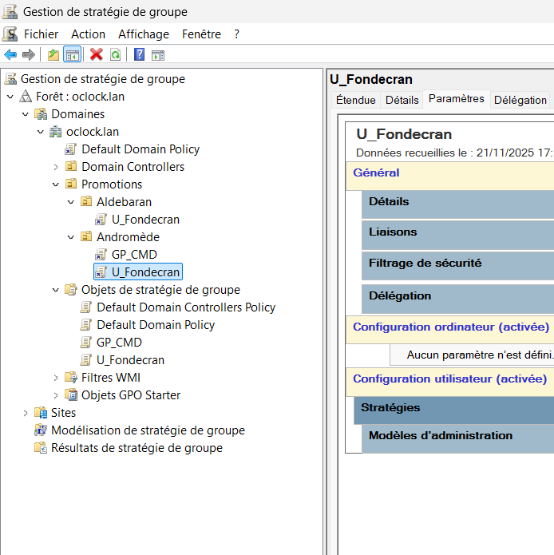
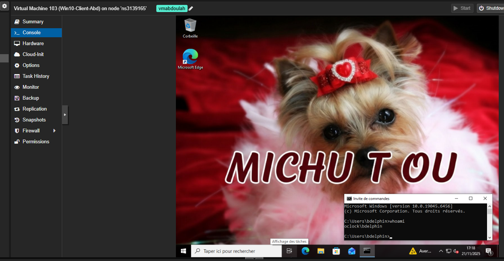

# challenge_Oclock

## Remettez a jour l’AD avec les informations suivantes (L’UO : RH peut être supprimée)

## Mettre en place une GPO lié aux fond écran utilisateur:
### Interdire le changement d’un fond d’écran

1er : création d'un partage pour que l'image puisse être déployer :

2eme application de la GPO sur les deux promotions 

connection sur le poste client baptiste , tout est ok 

