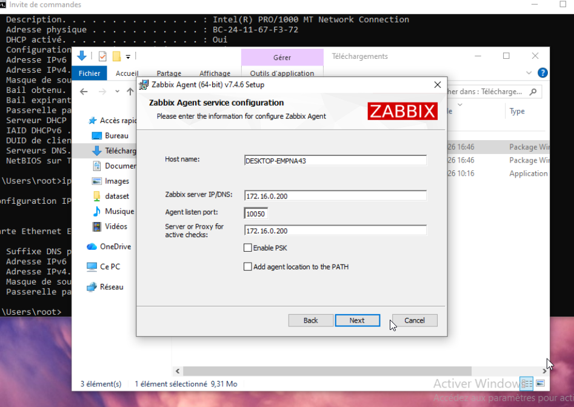
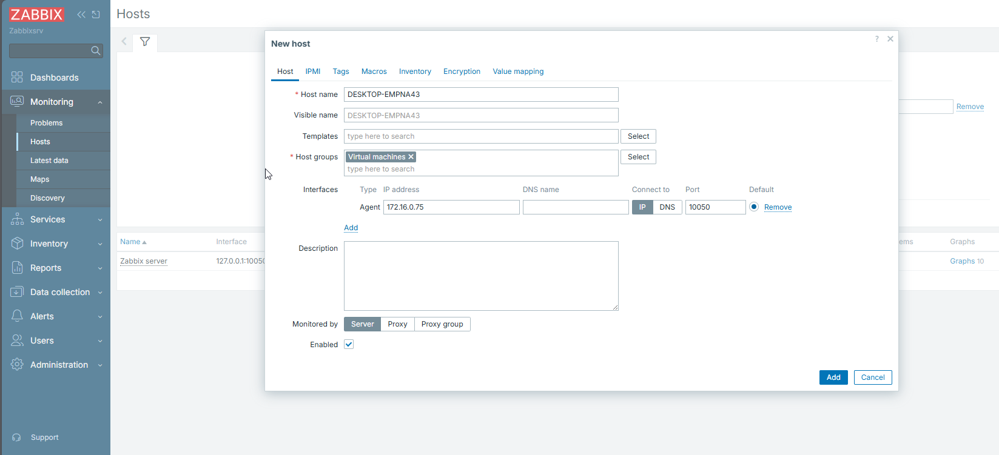

# Challenge SUPERVISION ZABBIX

## 1. Installation sur un contenaire LXC DEBIAN

> Récupération du nom de l'OS 

### 2. Mise en place d'une adresse ip static "172.16.0.200"

## 3. Installation de Zabbix

> SUIVI DE LA PROCEDURE INDIQUE DANS LA DOCUMENTATION OFFICIEL EN SELECTIONNANT LES ELEMENTS DESIRES

https://www.zabbix.com/download?zabbix=8.0&os_distribution=alma_linux&os_version=10&components=server_frontend_agent&db=mysql&ws=apache

Pendant l'installation j'ai eu un message d'erreur 

**root@ServeurZabbixABD:~# systemctl status mysql
Unit mysql.service could not be found.**

Il faut que le server Mariadb soit installer , installation en cours :

installation apt install mariadb-server -y
systemctl start mariadb
systemctl enable mariadb
systemctl status mariadb

## 4. Connection sur la UI web page

Message d'erreur 

avec mes talents de googleur pro , j'ai trouver un moyen de corriger l'erreur avec la commande indiqué ici :
https://bestmonitoringtools.com/how-to-install-zabbix-server-on-ubuntu/

Allez sur votre serveur ZABBIX et taper la commande : 

apt-get install -y locales && echo 'en_US.UTF-8 UTF-8' >> /etc/locale.gen && locale-gen && service apache2 restart

Plus d'erreur sur la capture suivante : 

## 5. Connection sur Zabbix

Use Zabbix default admin username “Admin” and password “zabbix”

## 6. Installation d'un agent sur Windows 10 client

rajout de l'host du zabbix

