⌨️ 
# Challenge - Mise en place d'une supervision réseau

## Objectif :

Mettre en place une alarme dans Zabbix qui doit se déclencher uniquement si le fichier test.txt n’existe pas sur les machines Windows surveillées.

## Consignes :

Le fichier test.txt doit être recherché à la racine du disque C: (ou à un autre emplacement défini).

Tant que le fichier est présent, l’alarme ne doit pas se déclencher (pas d’erreur, pas de problème).

Si l’utilisateur supprime le fichier :

Zabbix doit remonter une erreur indiquant que le fichier a été supprimé.
L’alarme doit être visible afin de prévenir l’administrateur.

##Points attendus :

Création ou utilisation d’un item Zabbix permettant de vérifier l’existence du fichier.
Mise en place d’un trigger qui s’active uniquement en cas d’absence du fichier.
Vérification que l’alarme ne génère pas de faux positifs (elle reste silencieuse tant que test.txt existe).
Astuce : pensez à tester votre configuration en créant puis en supprimant le fichier pour vérifier que le comportement correspond bien à la consigne.

# Challenge - Résolution du challenge 

## Mise en place d'un ITEM  :

1. création du fichier test dans la racine de la machine windows 

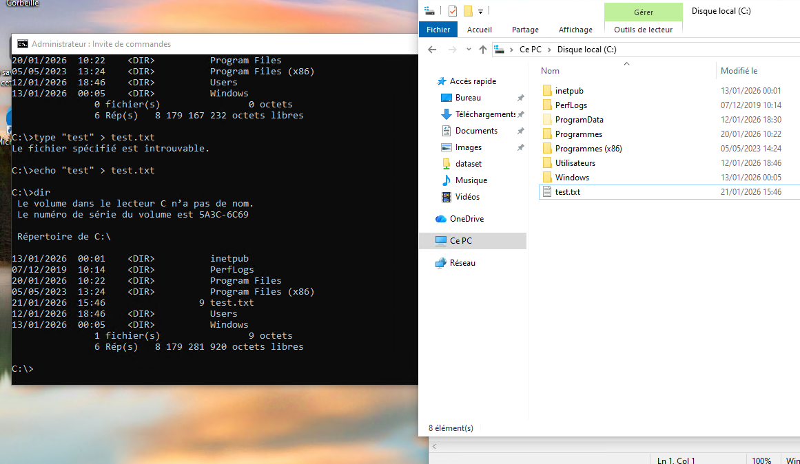

2. création de l'item sur la machine windows 

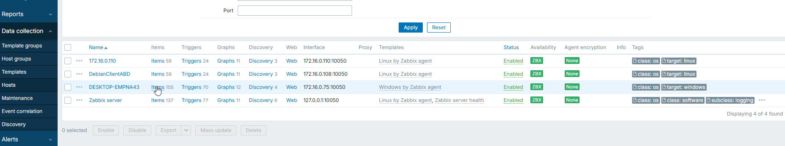

> pour trouver la clé de l'agent aller sur le site 
https://www.zabbix.com/documentation/current/en/manual/config/items/itemtypes/zabbix_agent

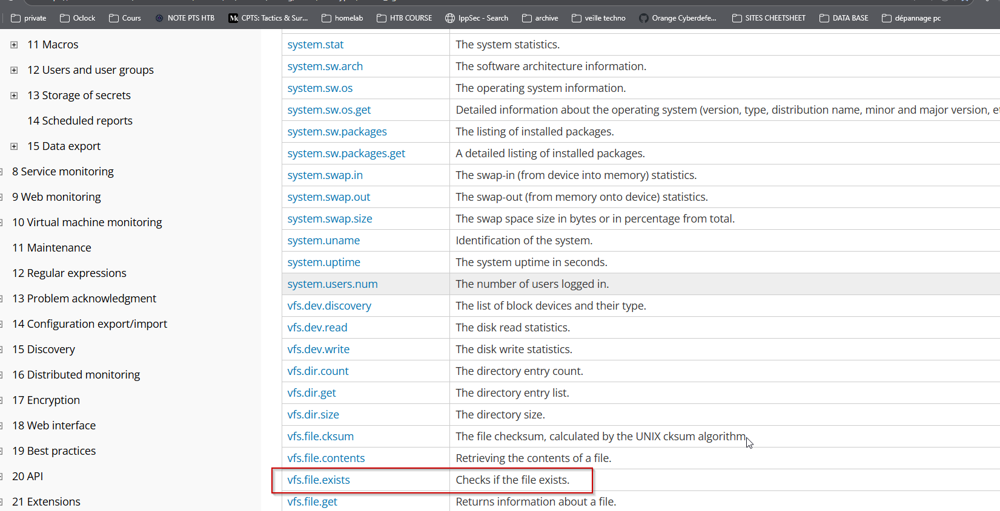

## Mise en place d'un trigger  :

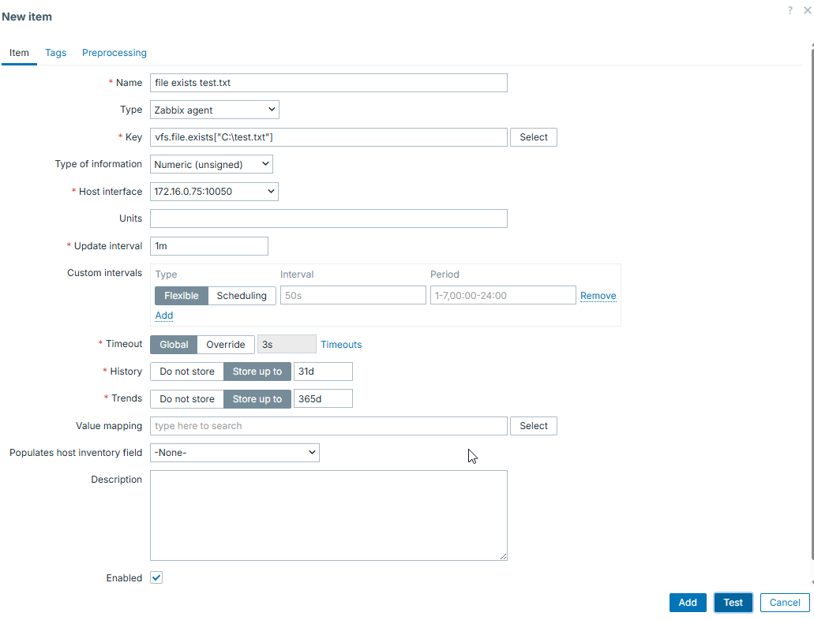

> test de l'item , c'est ok ! 

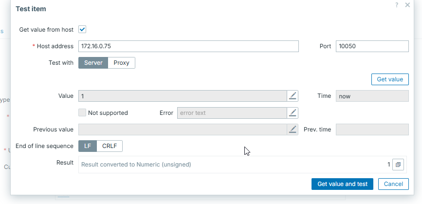

3. création du trigger sur la machine windows 

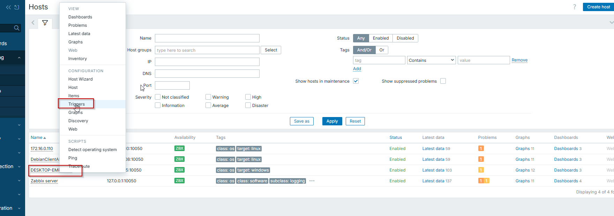

> choix de l'item crée

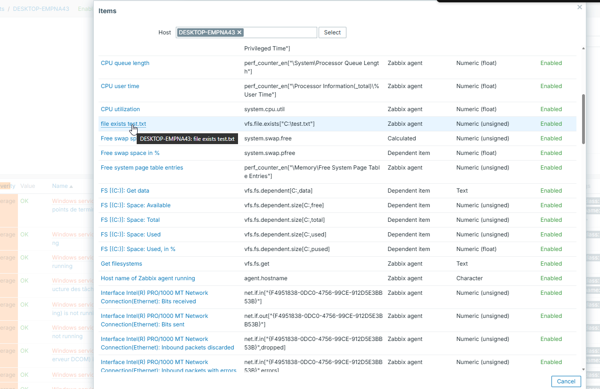

> configuration du trigger 

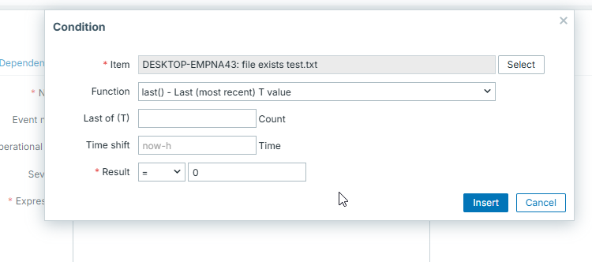

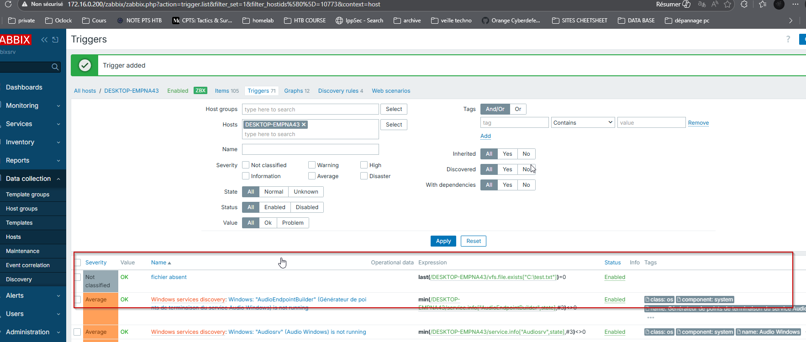

4. Test de l'alerte sur ZABBIX !

> suppression du fichier
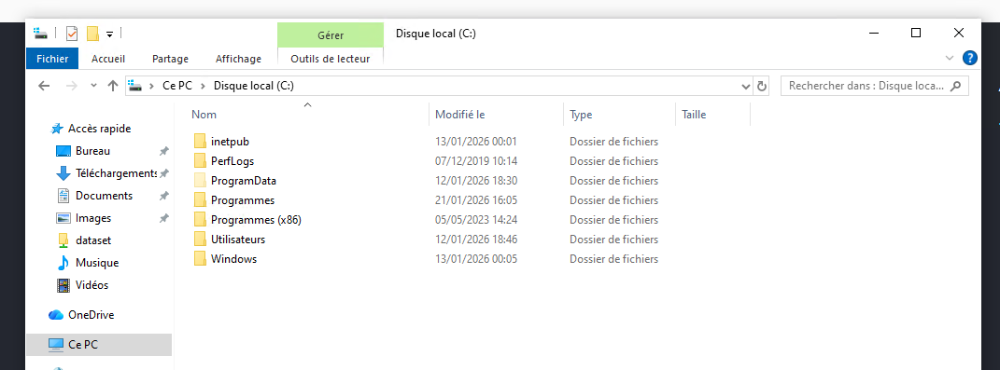

> l'alerte remonte bien 

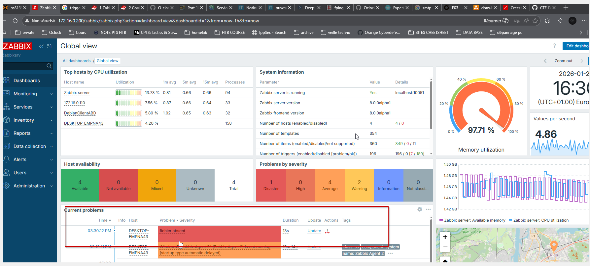

> Remise en place du fichier

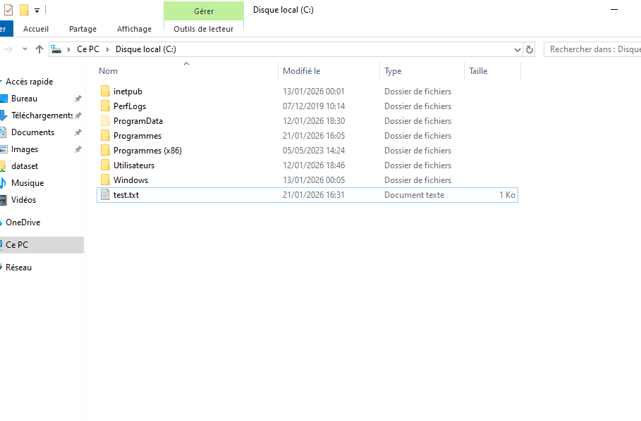

> l'alerte disparait 

