# Challenge - Mise en place d'une supervision réseau

## Objectifs du challenge

À l'issue de ce challenge, vous serez capable de :

* **Configurer et interroger** des équipements via le protocole **SNMP**.
* **Installer et configurer** **Zabbix** comme solution de supervision.
* **Comprendre la différence** entre la supervision **active** et **passive**.
* **Identifier les métriques essentielles** à surveiller pour maintenir la santé d'un parc informatique.

## ÉTAPE 1 - Configuration SNMP via Packet Tracer

### Configuration de l'interface Routeur:

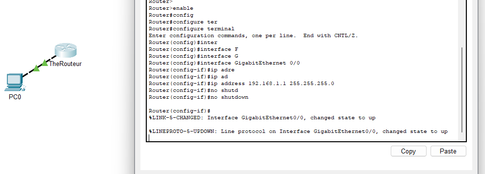

### Configuration de l'IP du poste client:

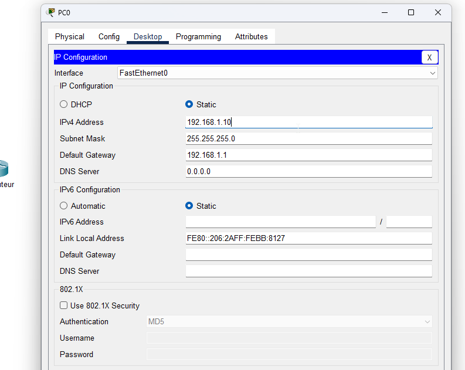

### Test de connectivité entre le routeur et le poste client 

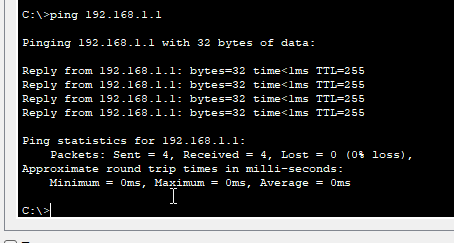

### Configuration du snmap sur le routeur 

> snmp-server community techsecure_ro

### Connection sur le PC pour récuperer les informations depuis le protocole snmp ok 

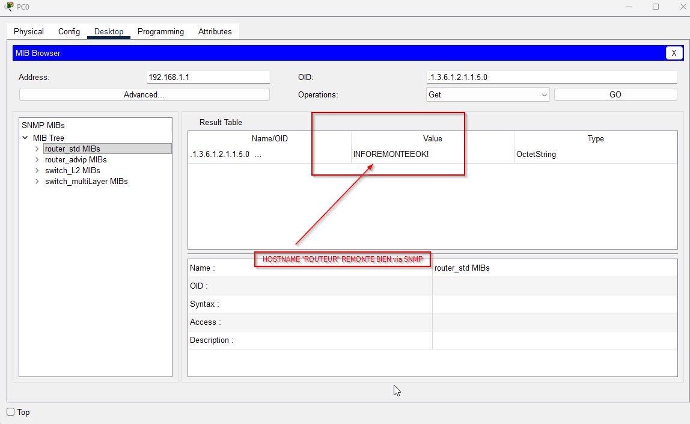

## 2. ÉTAPE - Interrogation SNMP

### Activation du protocole sur ma passerelle routeur pfSense

### Énumération des informations suivantes via SNMP :

**1. Le nom du système (sysName)**
* **Commande :** `snmpwalk -v2c -c techsecure_ro 172.16.0.1 .1.3.6.1.2.1.1.5.0`
* **Description :** Cette requête permet de confirmer le nom d'hôte (hostname) défini dans pfSense.

**2. La description du système (sysDescr)**
* **Commande :** `snmpwalk -v2c -c techsecure_ro 172.16.0.1 .1.3.6.1.2.1.1.1.0`
* **Description :** Retourne les informations sur l'OS (FreeBSD/pfSense) et la version du kernel.

**3. La liste des interfaces réseau**
* **Commande :** `snmpwalk -v2c -c techsecure_ro 172.16.0.1 .1.3.6.1.2.1.2.2.1.2`
* **Description :** Affiche la liste descriptive de toutes les interfaces réseau (WAN, LAN, etc.) détectées sur la passerelle.

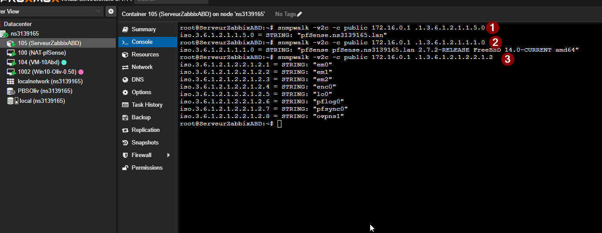

## 3. ÉTAPE - Installation de Zabbix Server dans un contenaire LXC 

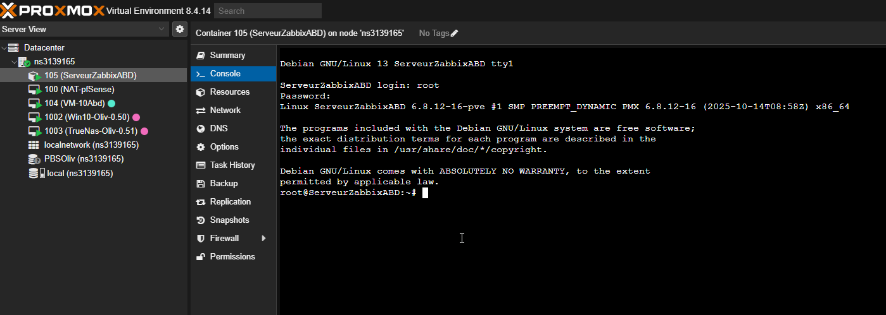

> Récupération du nom de l'OS 

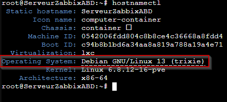

### 4. Mise en place d'une adresse ip static "172.16.0.200"

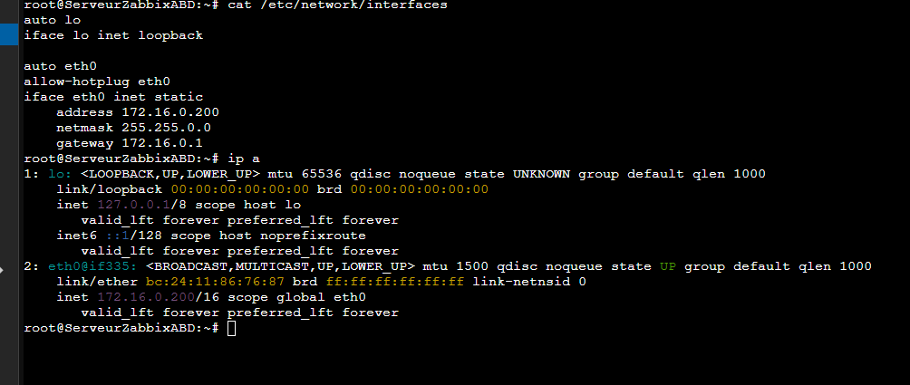

## 5. Installation de Zabbix

> SUIVI DE LA PROCEDURE INDIQUE DANS LA DOCUMENTATION OFFICIEL EN SELECTIONNANT LES ELEMENTS DESIRES

https://www.zabbix.com/download?zabbix=8.0&os_distribution=alma_linux&os_version=10&components=server_frontend_agent&db=mysql&ws=apache

Pendant l'installation j'ai eu un message d'erreur 

**root@ServeurZabbixABD:~# systemctl status mysql
Unit mysql.service could not be found.**

Il faut que le server Mariadb soit installer , installation en cours :

installation apt install mariadb-server -y
systemctl start mariadb
systemctl enable mariadb
systemctl status mariadb

## 6. Connection sur la UI web page

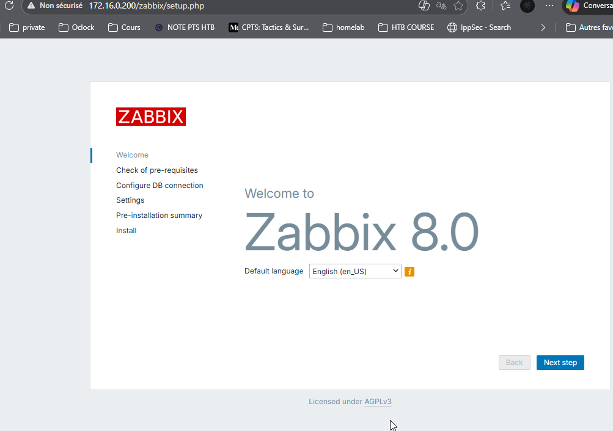

Message d'erreur 

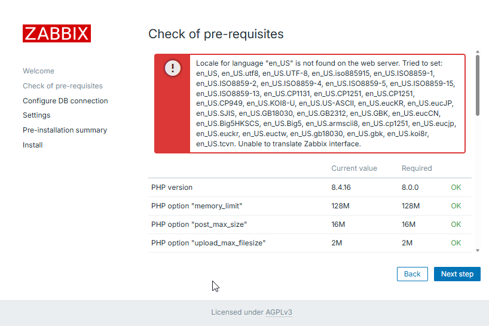

avec mes talents de googleur pro , j'ai trouver un moyen de corriger l'erreur avec la commande indiqué ici :
https://bestmonitoringtools.com/how-to-install-zabbix-server-on-ubuntu/

Allez sur votre serveur ZABBIX et taper la commande : 

apt-get install -y locales && echo 'en_US.UTF-8 UTF-8' >> /etc/locale.gen && locale-gen && service apache2 restart

Plus d'erreur sur la capture suivante : 

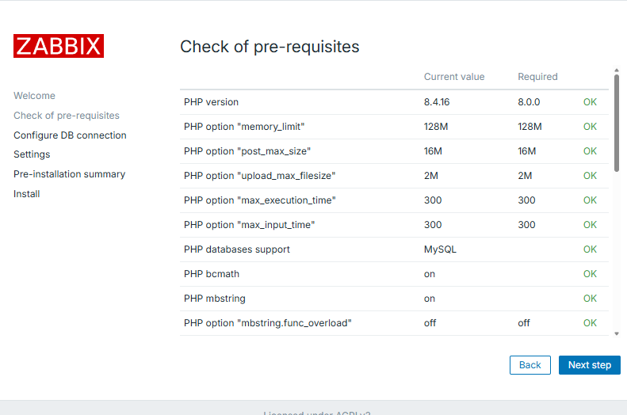

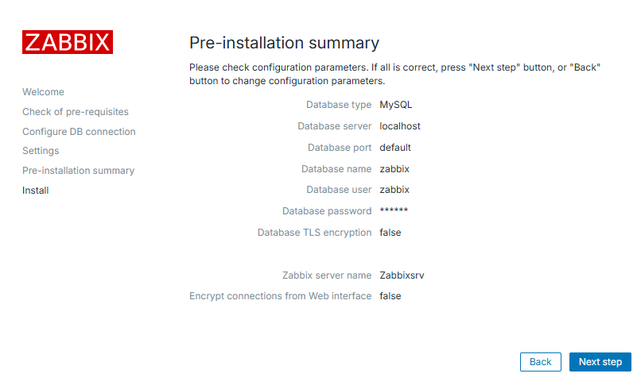

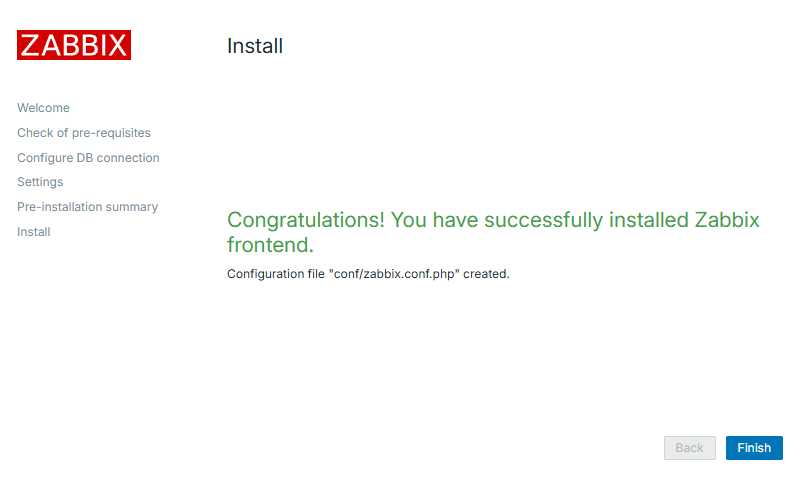

## 7. Connection sur Zabbix

Use Zabbix default admin username “Admin” and password “zabbix”

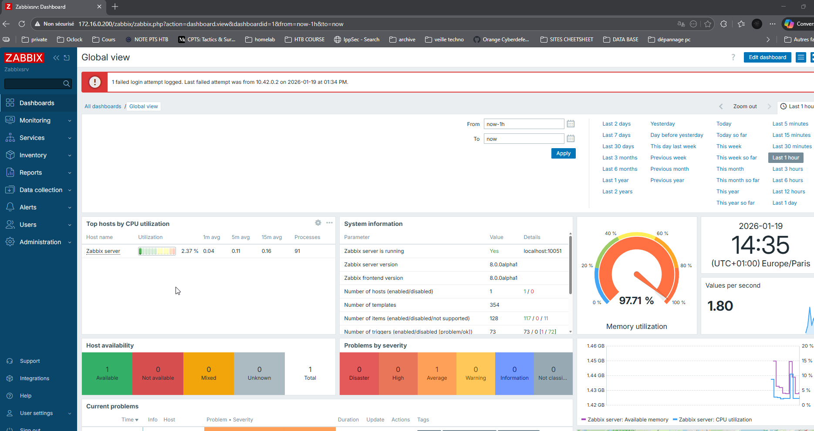

