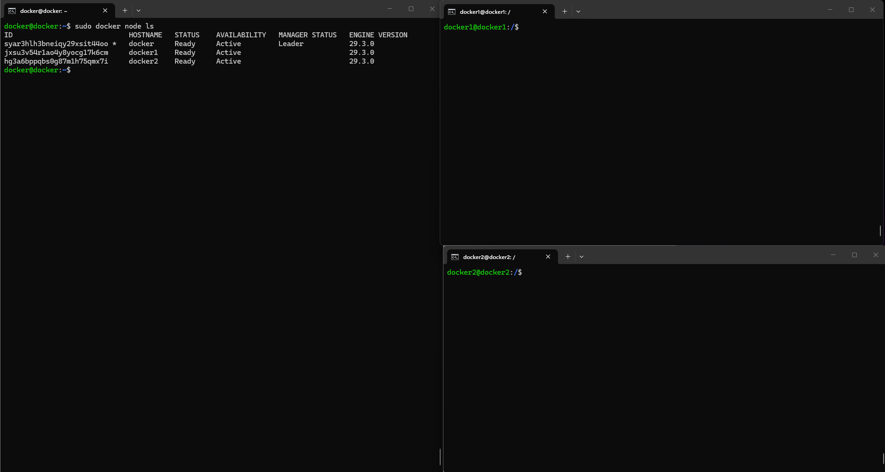
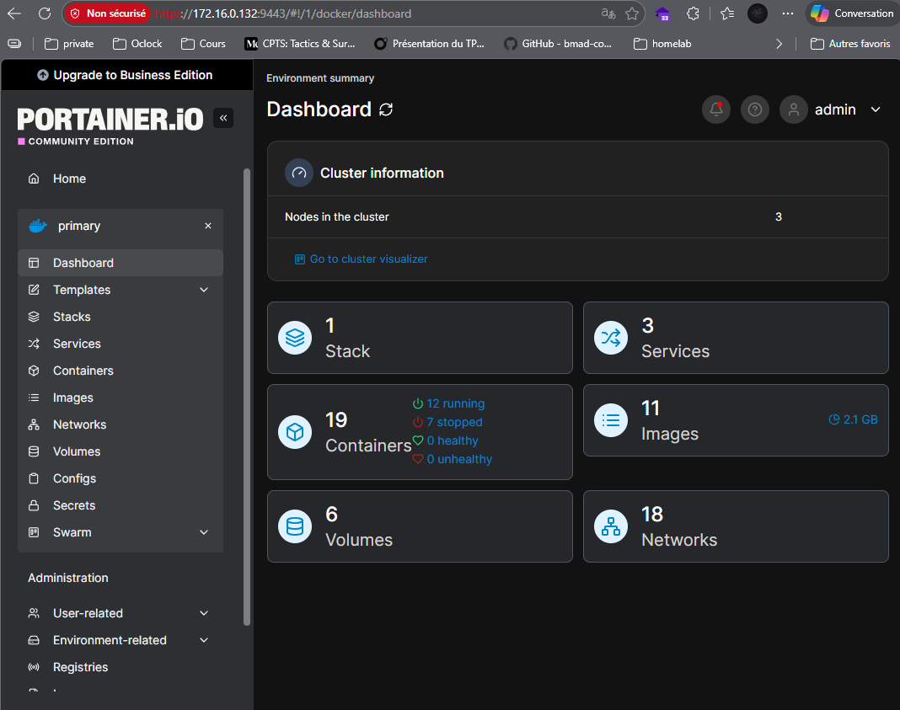

# 🐋 Déployer GLPI avec Docker Compose

## Énoncé

## 🗂 Contexte

Hier soir, nous avez déployé GLPI avec Docker Compose sur une seule machine. C'est bien, mais pas suffisant pour une infrastructure de production.

Votre responsable veut maintenant **haute disponibilité** : si un serveur tombe, l'application doit continuer à fonctionner. Pour ça, on va passer à **Docker Swarm** — le mode cluster intégré à Docker — et déployer GLPI en plusieurs **replicas** gérés via **Portainer**.

> 💡 **Docker Compose vs Docker Swarm**
> - Compose → un seul hôte, idéal pour le développement
> - Swarm → plusieurs hôtes, orchestration, haute disponibilité
> - La bonne nouvelle : la syntaxe reste très proche, on réutilise le `compose.yaml` que nous avons créer lors de votre challenge !

## PRATIQUE

## 🏗️ Configuration de mon Infrastructure Docker Swarm

| Nom de l'Hôte | Adresse IP | Rôle Swarm | Système d'Exploitation | Version Docker |
| :--- | :--- | :--- | :--- | :--- |
| **VMdocker** | `172.16.0.132` | 👑 **Leader** | Debian 13 (Trixie) | 29.3.0 |
| **VM-docker1** | `172.16.0.133` | 👷 Worker | Debian 13 (Trixie) | 29.3.0 |
| **VM-docker2** | `172.16.0.137` | 👷 Worker | Debian 13 (Trixie) | 29.3.0 |

## 🏗️ Accès à portainer via l'adresse https://172.16.0.132:9443

> *https://172.16.0.132:9443/#!/1/docker/dashboard*

