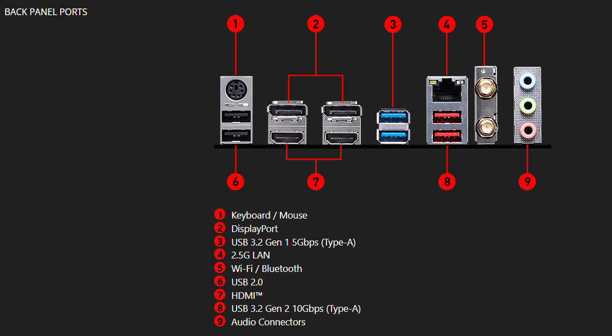

# ⌨️ Challenge — Les connecteurs et composants de votre ordinateur

## 🎯 Objectif de l’exercice

Prenez en photo les **différents connecteurs** présents sur votre ordinateur et **cherchez le nom le plus précis possible** de chaque port présent sur votre machine.

---

## 🖥️ Pour les utilisateurs de PC fixe

1. **Éteignez et débranchez** votre ordinateur ⚠️  
2. **Ouvrez la façade** de votre tour.  
3. Prenez une **photo des composants internes**.  
4. **Identifiez chaque composant** visible (ex. : carte mère, RAM, alimentation, carte graphique, disque dur, etc.).

---

## 💻 Pour les utilisateurs de PC portable ou ceux qui ne souhaitent pas ouvrir leur PC

- Utilisez une **photo d’un PC fixe ouvert** trouvée sur Internet.  
- Réalisez le **même exercice d’identification** des composants.

---

## 🎓 En bonus

🧠 **Renseignez-vous sur le montage d’un PC fixe !**  
Il existe de nombreuses ressources en ligne — **YouTube** est une excellente piste pour découvrir les bases du montage.

---

## 🎮 Bonus fun

💡 Essayez le jeu **[PC Creator 2] (disponible sur **Android** et **iOS**) pour **découvrir le montage d’un PC** de manière ludique !

---

---

## 📸 MA réponse au challenge !!!! , voici **mon PC FIXE** : 

### Vue intérieure : 

MOTHERBOARD : MSI B760M Gaming Plus WiFi
VENTIRAD : Thermalright Peerless Assassin 120 SE Refroidisseur d'air CPU
GPU  : GEFORGE RTX 2080
ALIM: THERMALTAKE SMART RGB 600W SMART SERIES
CPU : Intel Core i7-12700KF (3.6GHz/5.0GHz) 
RAM G.Skill Trident Z5 RGB 2x16 Go (32 Go) DDR5 6000 MHz CL36 - Blanc
3 DD : 
SAMSUNG 990 EVO PLUS 1 To PCIe 5.0
Samsung SSD 860 QVO 1 To
Western DIGITAL WD10JUCT-63CYNY0 1 To SATA 

### Vue des connecteurs : 

---
