## ⌨️ Challenge

Essayez l’outil MemTest86 sur votre PC !

Il vous faudra pour cela une clé USB, sauvegardez tout ce que vous avez dessus avant de suivre les instructions ci-dessous ! ⚠️

1. Téléchargez MemTest86 Free depuis le https://www.memtest86.com/download.htm
2. Trouvez le moyen de « l’installer » sur votre clé USB, en suivant les instructions officielles ou en cherchant un peu sur Internet ! (attention à ne pas effacer votre disque dur malencontreusement !)
3. Redémarrez votre PC et bootez sur MemTest !
4. Lancez un test complet de votre RAM.

💡 Si vous ne voulez pas prendre de risque, vous pouvez aussi tenter de lancer MemTest86 sur une machine virtuelle. À vous de trouver comment faire 😉

### 🏆 Challenge Bonus

Rendez-vous avec des outils de prise en main à distance, que ce soit AnyDesk, TeamViewer, ou même les outils natifs de votre système d’exploitation.

L’objectif est simplement d’explorer leurs possibilités et de tester par vous-même différents outils.

## ⌨️ REALISATION des Challenges : 

## Méthodologie 🧪

1. Installation de **MemTest86** sur une clé USB de 4 Go en suivant les instructions officielles.
2. Création de l'image sur la clé USB.
3. Utilisation de la touche F2 afin de pouvoir boot sur le bios et configurer le boot sur la clé.
4. Test de la RAM sur un PC portable Asus ZenBook Duo.

#### 1 : Installation et création de l'image sur la clé USB : 
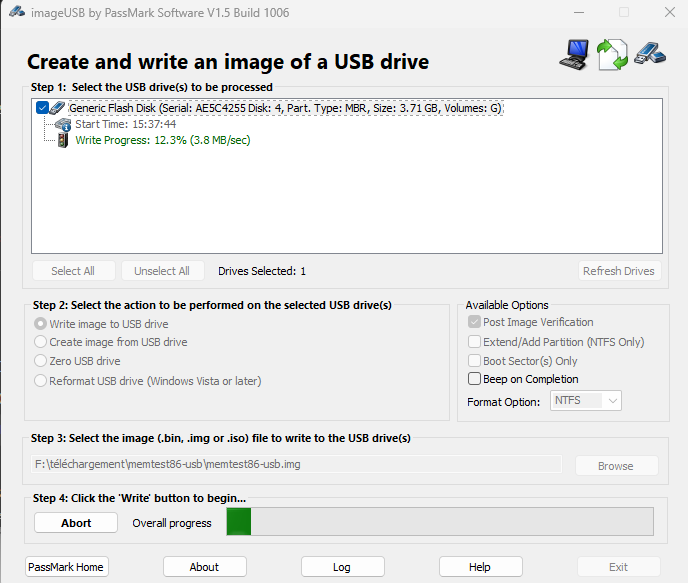  

#### 2 : Création de l'image sur la clé USB fait : 

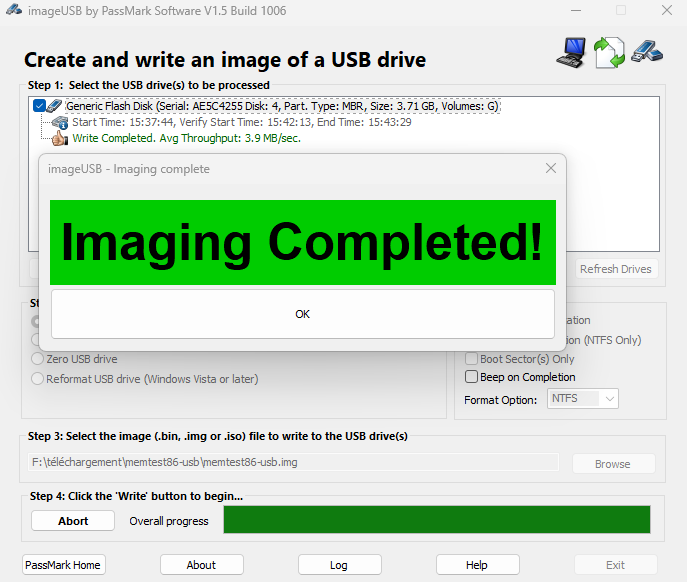

#### 3 : Utilisation de la touche "F2" pour boot sur le bios et mettre le boot sur la clé usb.

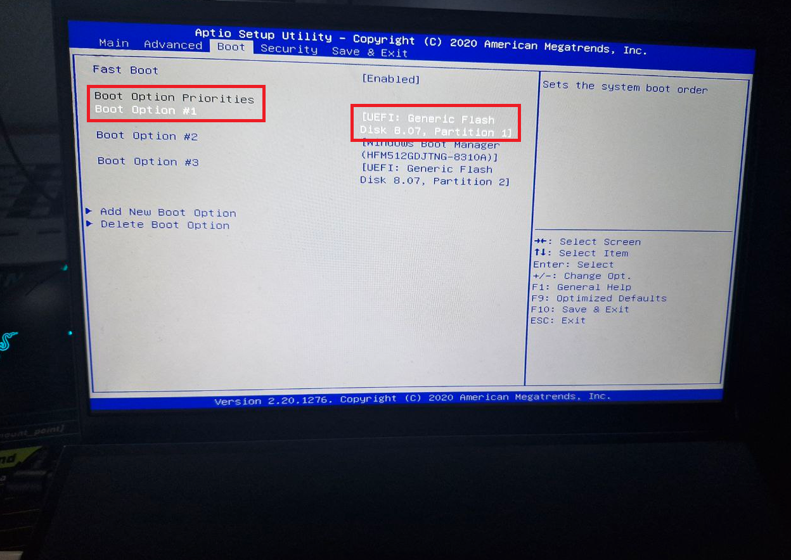

#### 4 : Test de la mémoire vive de mon ordinateur : 

## photo 1 : début du test : 

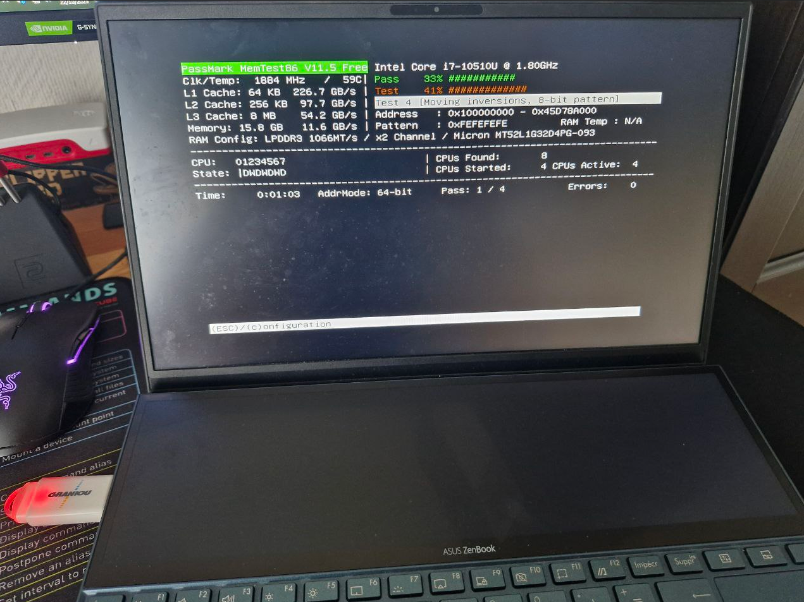

## photo 2 : Après environ deux heures de test et 2 passes , pas d'erreurs detectées.  : 

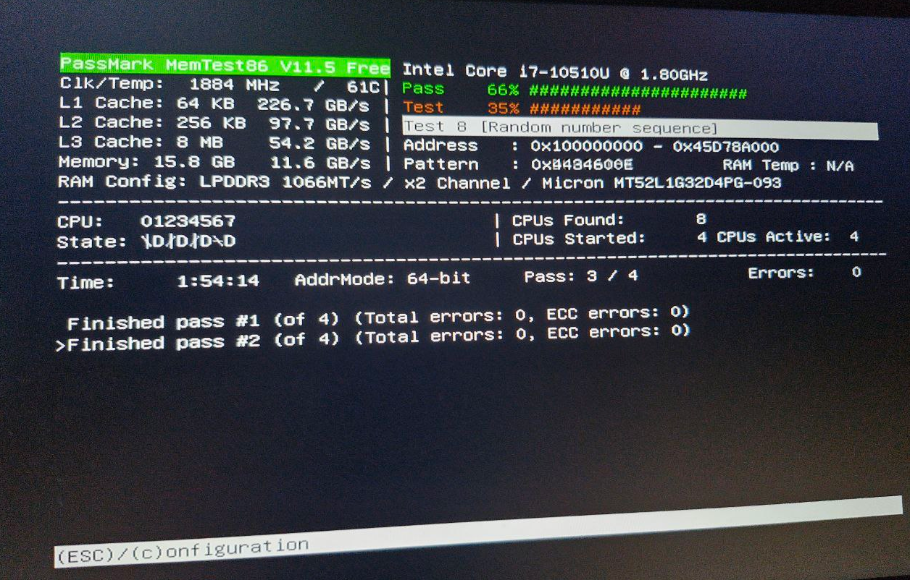

## 🧩 Challenge Bonus :  POSTE TECHNICIEN WIN11 - POSTE CLIEN WIN10 : ANYDESC - TEAMVIEWER - RUSTDESC - ASSISTANCE RAPIDE WINDOWS 

| Outil d'assitance     | Vue Technicien (Windows 11)                               | Vue Client (Windows 10)                           |
| :--------------------- | :-------------------------------------------------------: | :-----------------------------------------------: |
| 💻 **AnyDesk** | 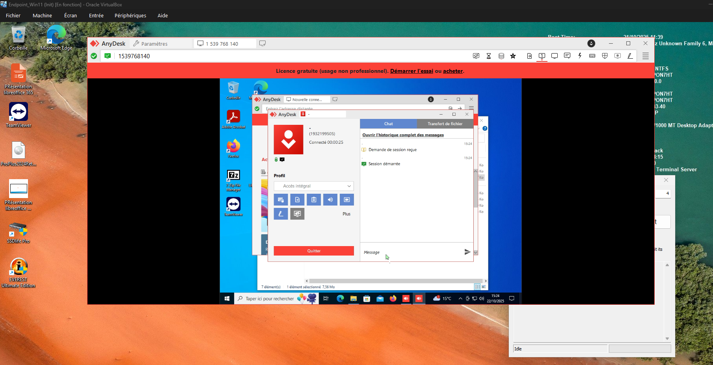                | 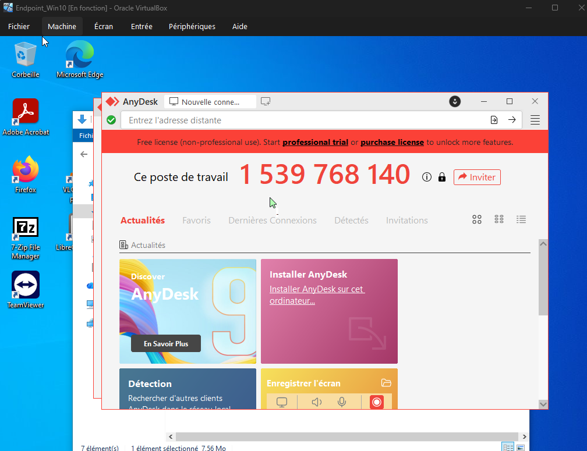            |
| 🌐 **TeamViewer** | 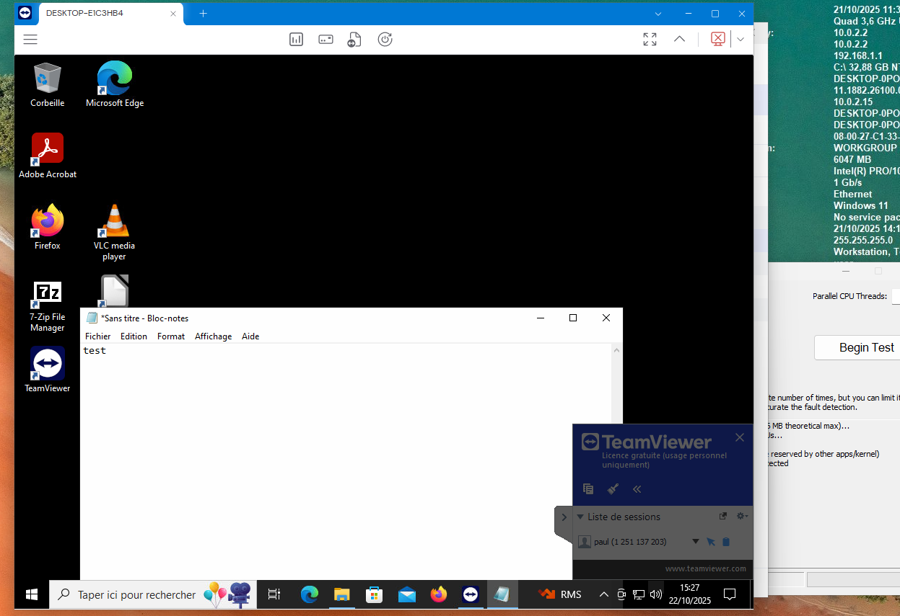             | 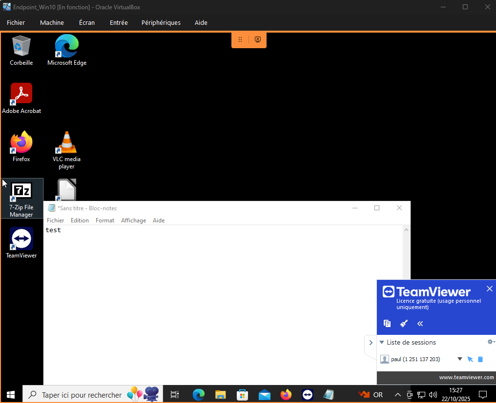         |
| 🦀 **RustDesk** | 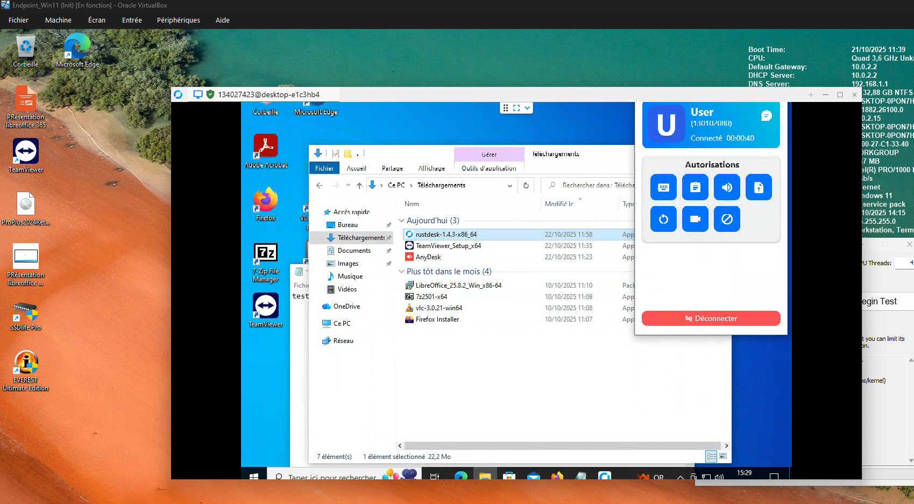               | 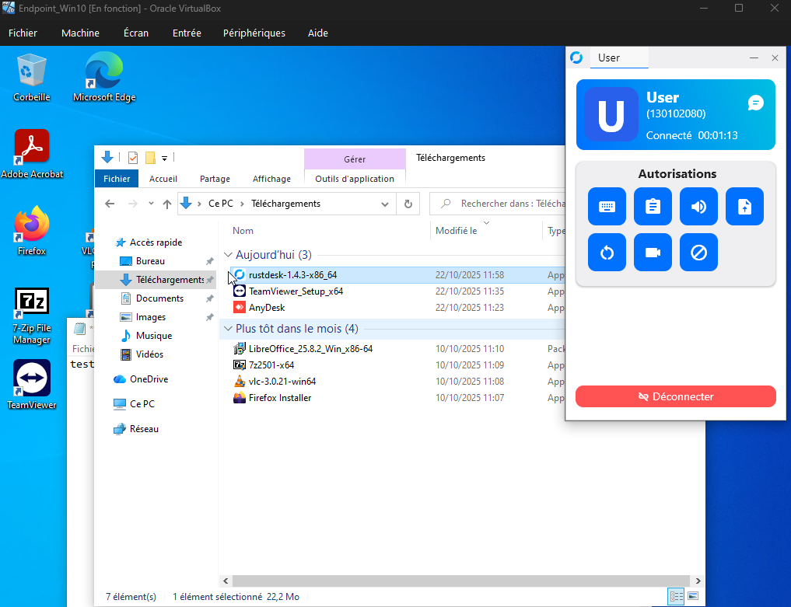           |
| 🪟 **Assistance Rapide** | 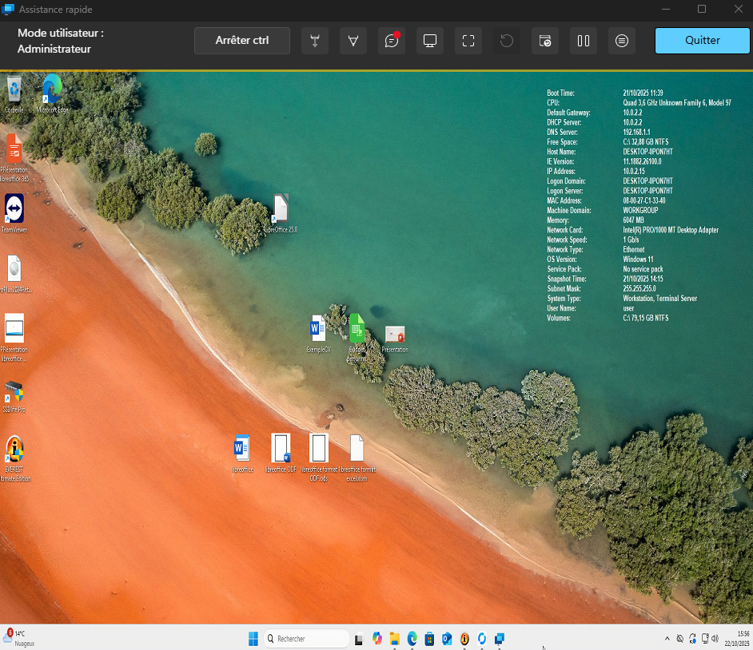 | ** |